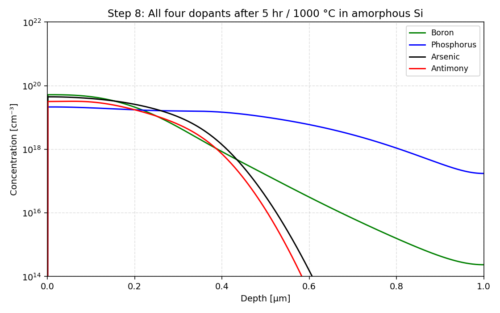
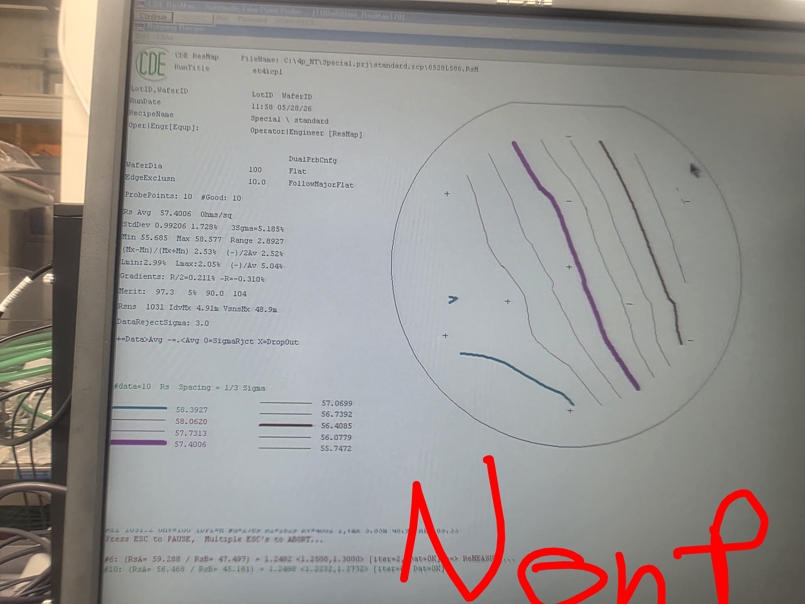
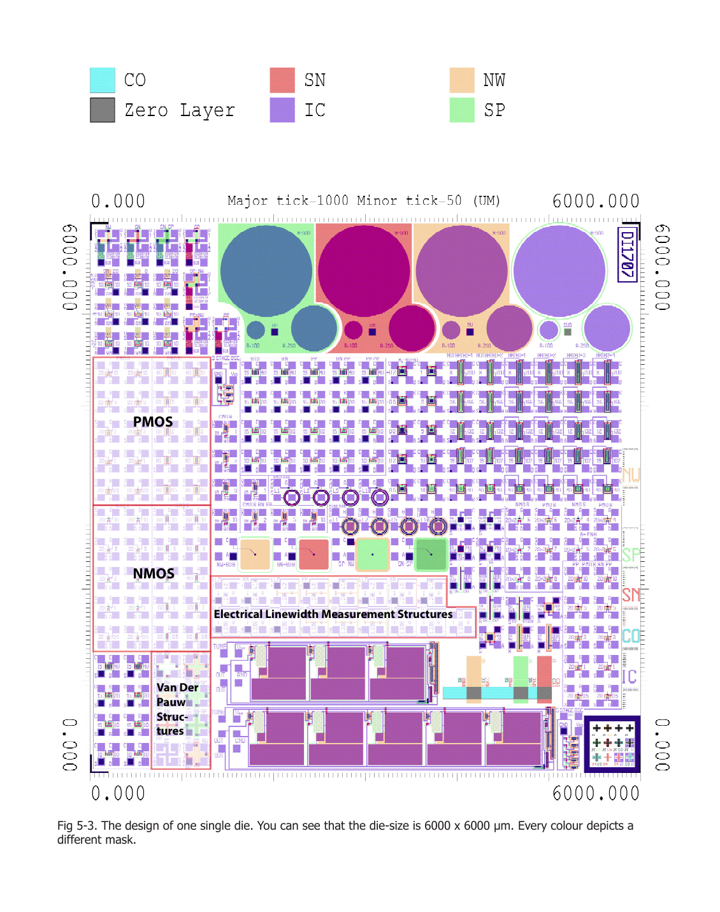
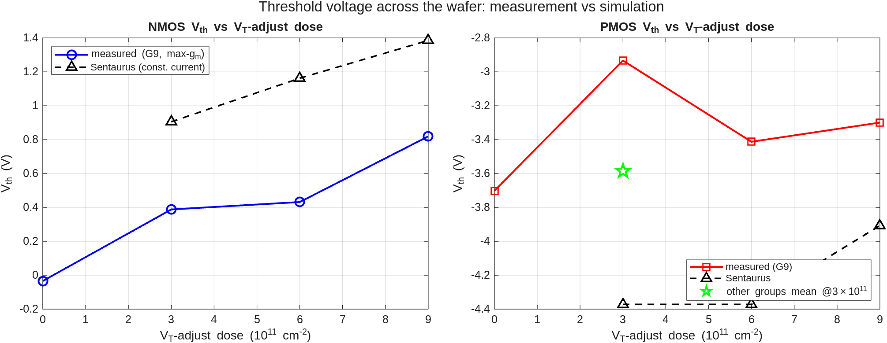
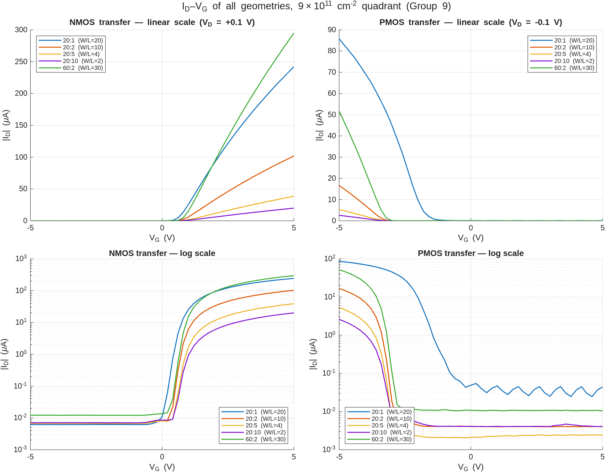

# ET4icp — IC Technology Practical Course


Full lab record for **ET4icp — IC Technology Practical Course** at TU Delft, run in the
**Else Kooi Laboratory (EKL)**. The course fabricates NMOS and PMOS transistors in the
**BICMOS5** process and follows them the whole way through:

> **theory → process/device simulation → cleanroom processing → electrical measurement → report**

This repository is our group's (Group 9) worked solutions, raw data, analysis scripts, and
report-ready figures for every stage. Each chapter's `assignments.md` quotes the manual's
questions and answers them in place, with equations rendered and figures embedded — so the
whole thing doubles as a self-contained walkthrough of a real CMOS process flow.

---

## Gallery

<table>
<tr>
<td width="50%" align="center">
<br>
<sub><b>Ch.3 · Process sim</b> — dopant profiles after implant + drive-in (Sentaurus)</sub>
</td>
<td width="50%" align="center">
<br>
<sub><b>Ch.3 · Device sim</b> — simulated NMOS cross-section</sub>
</td>
</tr>
<tr>
<td width="50%" align="center">
<br>
<sub><b>Ch.4 · Processing</b> — SN sheet-resistance map (57 Ω/□, cleanroom four-point probe)</sub>
</td>
<td width="50%" align="center">
<br>
<sub><b>Ch.5 · Layout</b> — one 6×6 mm die, every colour a mask layer</sub>
</td>
</tr>
<tr>
<td width="50%" align="center">
<br>
<sub><b>Ch.6 · Measurement</b> — V_th vs V_T-adjust dose, measured vs simulated</sub>
</td>
<td width="50%" align="center">
<br>
<sub><b>Ch.6 · Measurement</b> — I_D–V_G transfer curves across transistor geometries</sub>
</td>
</tr>
</table>

---

## Headline results (Group 9)

Extracted from the fabricated wafer and cross-checked against the 6-group class consensus
(fit R² > 0.99 throughout):

| Quantity | Value |
|---|---|
| Sheet resistance R□ (Van der Pauw): NW / SN / SP / metal | 1740.5 / 60.2 / 488.4 / 0.16 Ω/□ |
| Doping N̄ (Irvin, with Sentaurus xⱼ): NW / SN / SP | 1.5×10¹⁶ / 2.3×10¹⁹ / 1.6×10¹⁸ cm⁻³ |
| Lateral out-diffusion ΔW (ELM): SN / NW | ≈0.15 µm / ≈0.8–2.1 µm per side |
| Long-channel mobility µₙ / µₚ | ≈750 / ≈240 cm²/V·s |
| Threshold V_th (9×10¹¹ quadrant, W:L 20:5): NMOS / PMOS | +0.82 V / −3.30 V |
| V_th vs dose (0 → 9×10¹¹): NMOS / PMOS | −0.03 → +0.82 V / −3.70 → −3.30 V (both monotonic) |
| Channel-length modulation λ (20:5 / 20:1) | ≈0.02 / ≈0.2 V⁻¹ (PMOS 20:1 shows punch-through) |

The core physics quantities — threshold voltage and doping concentration — are compared across
**theory (Ch.2) ↔ simulation (Ch.3) ↔ processing (Ch.4) ↔ measurement (Ch.6)** in the report
cross-comparison table.

---

## The pipeline

| Stage | Chapter | What we did | Output |
|---|---|---|---|
| 📐 **Theory** | [Ch.2](chapter02-ic-fabrication/) | Deal–Grove oxidation, implant range, junction depth by hand | Assignments 1–5 |
| 🧪 **Simulation** | [Ch.3](chapter03-simulations/) | Sentaurus process + device sims (implant, diffusion, masking, I–V, V_T vs dose) | 14 profile + 20 device plots |
| 🔬 **Processing** | [Ch.4](chapter04-processing/) | 2½-day cleanroom session: four-point probe, ellipsometry, wet/dry etch | Sheet-res maps, oxide thickness, etch rates |
| 🗺️ **Layout** | [Ch.5](chapter05-wafer-layout/) | Wafer / die / test-structure reference (VdP, ELM, MOSFET arrays) | Annotated layout notes |
| 📊 **Measurement** | [Ch.6](chapter06-measurements/) | PCM electrical characterization on Cascade + B1500A, full MATLAB pipeline | 10 report-ready figures |
| 📝 **Report** | [Ch.7](chapter07-report/) | Requirements, grading rubric, cross-comparison of all four stages | Report scaffold |

---

## Repository structure

```
tud-ic-technology-lab/
├── manuals/                       Course manual (ET4icp 2025v2) + simulation-classroom guide (PDF)
│
├── chapter02-ic-fabrication/      Theory — Assignments 1–5
│   └── assignments.md             Deal–Grove oxidation, implant range, junction depth
│
├── chapter03-simulations/         Sentaurus process + device simulations (EKL server)
│   ├── assignments.md             Process-sim write-up, steps 1–15
│   ├── device_sims_assignments.md Device-sim write-up (I–V, V_T extraction)
│   ├── sim_data/                  Raw .cmd/.out + analyze.py + plots/ (14 dopant profiles)
│   └── device_sims/               NMOS/PMOS structures, Id–Vg / Id–Vd, VT-vs-dose (plots/)
│
├── chapter04-processing/          Cleanroom session data + answers
│   ├── assignments.md             Implantation, etch selectivity, oxide etch-rate
│   ├── data/                      Lab photos: sheet-res maps, ellipsometer spectra (26 images)
│   └── ET4G9/                     Group 9 wet-/dry-etch microscopy
│
├── chapter05-wafer-layout/        Wafer / die / test-structure reference
│   ├── wafer-layout.md            Mask legend, transistor arrays, VdP + ELM structures
│   └── figures/                   Wafer, die, NMOS/PMOS blocks, Van der Pauw, ELM
│
├── chapter06-measurements/        PCM electrical measurements  ✅ complete
│   ├── assignments.md             Every Ch.6 question answered in place, figures embedded
│   ├── matlab/analyze_ch6.m       Full analysis pipeline (regenerates every figure)
│   ├── IC/                        Raw IC-CAP exports (Group 9 + other groups for cross-check)
│   ├── figures/                   10 report-ready PNGs (VdP fits, ELM ΔW, I–V, V_th vs dose)
│   └── extracted_parameters.txt   Every extracted number in one dump
│
└── chapter07-report/              Final report
    ├── README.md                  Manual requirements + 24-point grading rubric
    └── report-materials.md        Rubric checklist + theory↔sim↔process↔measurement table
```

---

## Chapter detail

### 📐 Chapter 2 — IC Fabrication theory
Five hand-worked assignments on the BICMOS5 flow: marker-oxidation step height (Deal–Grove),
implantation range/straggle, and junction-depth estimates that become the reference for every
later stage. → [`chapter02-ic-fabrication/assignments.md`](chapter02-ic-fabrication/assignments.md)

### 🧪 Chapter 3 — Simulations
Sentaurus **process** simulations (`sprocess`) for implant, implant+diffusion, and
implant+masking across the four dopants (P, As, B, Sb), plus **device** simulations
(`sdevice`) producing NMOS/PMOS cross-sections, doping cutlines, and full I_D–V_G / I_D–V_DS
families. Everything is re-derivable from the raw `.out`/`.plt` files via the checked-in
Python scripts (`analyze.py`, `analyze_device.py`), and junction depths flow forward into the
Ch.6 Irvin doping extraction. → [`chapter03-simulations/`](chapter03-simulations/)

### 🔬 Chapter 4 — Processing (cleanroom)
The 2½-day EKL cleanroom session on partially-processed wafers: four-point-probe sheet-resistance
maps for NW / SN / SP, ellipsometer oxide-thickness measurements before/after BHF etch (thermal
and PECVD oxide), and wet vs dry etch selectivity under the microscope. → [`chapter04-processing/`](chapter04-processing/)

### 🗺️ Chapter 5 — Wafer layout
Reference for the course wafer: 10 cm wafer, 160+ dies of 6×6 mm, four V_T-adjust quarters
(0 / 3 / 6 / 9 ×10¹¹ cm⁻²), the mask legend, and the on-die test structures — MOSFET arrays
(L = 20, 60 µm; W = 0.5–10 µm), Greek-cross Van der Pauw, and ELM differential resistors.
→ [`chapter05-wafer-layout/wafer-layout.md`](chapter05-wafer-layout/wafer-layout.md)

### 📊 Chapter 6 — Measurements
The measurement-heavy chapter, **complete and validated**. PCM characterization on a
Cascade 31 probe station + Keysight B1500A (IC-CAP). Van der Pauw → sheet resistance → doping;
ELM → lateral out-diffusion ΔW; MOSFET transfer/output → V_th, mobility, and short-channel
effects (CLM, punch-through). No IC-CAP screenshots — all data re-plotted in MATLAB. A single
`matlab -batch analyze_ch6` regenerates every figure and `extracted_parameters.txt`.
→ [`chapter06-measurements/`](chapter06-measurements/)

### 📝 Chapter 7 — Report
Everything needed to write the final group report: the manual's required content, the full
24-point grading rubric, a rubric-criterion → repo-folder map, and the cross-comparison table
that pulls the theory / simulation / processing / measurement numbers together for the
conclusion. → [`chapter07-report/`](chapter07-report/)

---

## Reproducing the analysis

- **Chapter 6 figures & numbers** — from `chapter06-measurements/`:
  ```bash
  matlab -batch analyze_ch6
  ```
  Regenerates all 10 figures in `figures/` and `extracted_parameters.txt` from the raw IC-CAP
  exports in `IC/Group 9/`.

- **Chapter 3 dopant-profile plots** — from `chapter03-simulations/sim_data/`:
  ```bash
  python3 analyze.py
  ```
  Re-runs the analysis and regenerates the 14 profile plots from the raw `.out` files
  (numpy + matplotlib, no pandas needed).

- **Chapter 3 device plots** — from `chapter03-simulations/device_sims/`:
  ```bash
  python3 analyze_device.py
  ```

---

## Tools & environment

- **Sentaurus TCAD** (`sprocess`, `sdevice`, `swb`) on the EKL server
  `et4icp.ewi.tudelft.nl`, reached over TU Delft VPN — see
  [`manuals/Virtual classroom for ET4icp simulations.pdf`](manuals/).
- **Cascade 31** probe station + **Keysight B1500A** parameter analyzer, **IC-CAP 2022**
  (`ICCourse.mdl`) for the electrical measurements.
- **MATLAB** (Ch.6 analysis) and **Python** — numpy / matplotlib (Ch.3 analysis).
- Cleanroom metrology: four-point probe, spectroscopic ellipsometer, optical microscopy.

---

## Notes

- Worked solutions live in each chapter's `assignments.md`; equations are written so they
  render directly on GitHub and can be lifted into the final report.
- Data from other groups (`chapter06-measurements/IC/other/`) is kept only to cross-validate
  our own — the headline numbers above are Group 9's measurements.
- This is coursework for TU Delft ET4icp. It is shared as a reference and portfolio piece;
  please don't submit any of it as your own (the course runs a plagiarism check).
