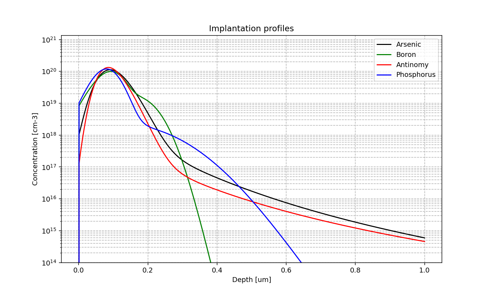
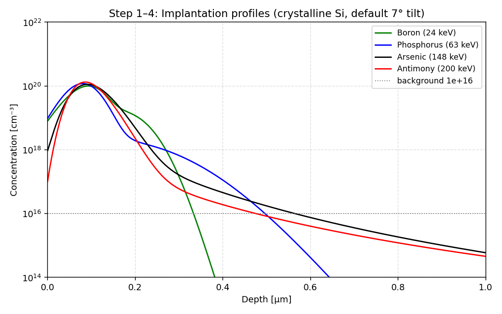
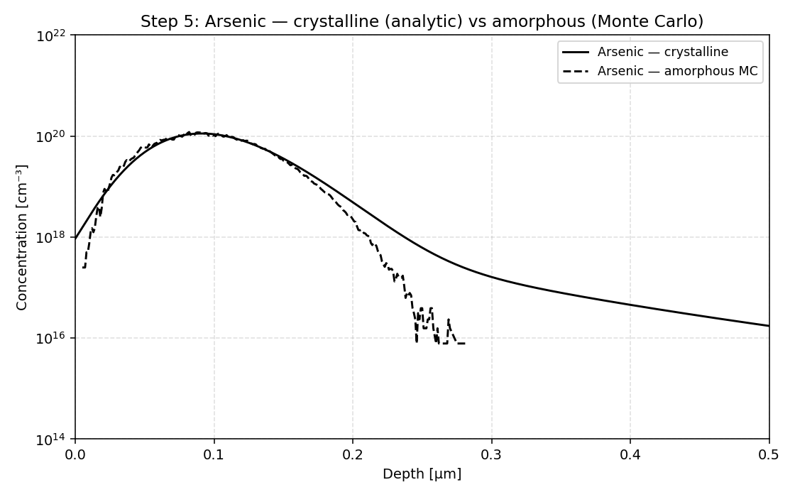
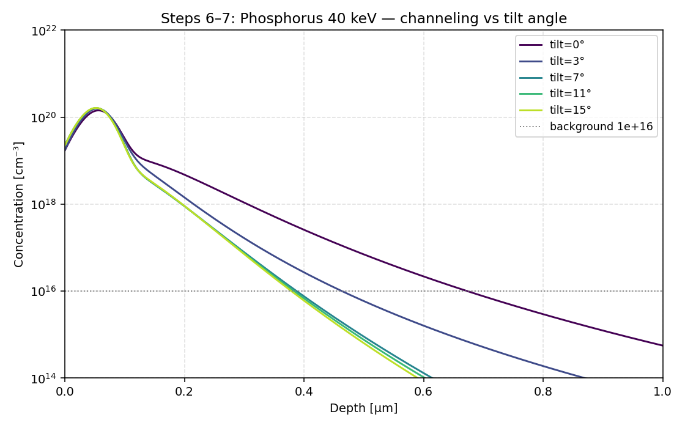
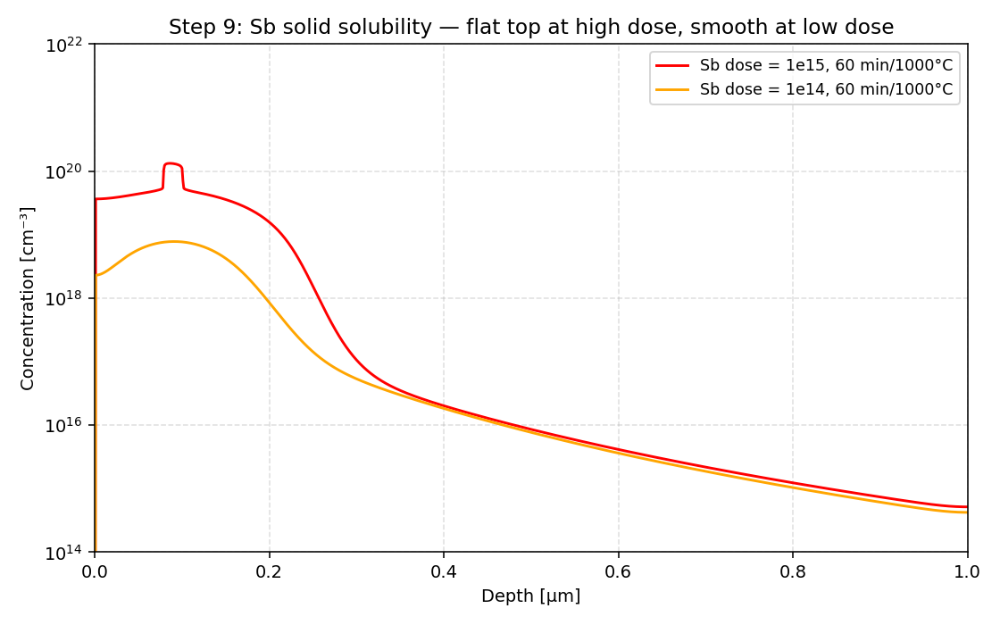
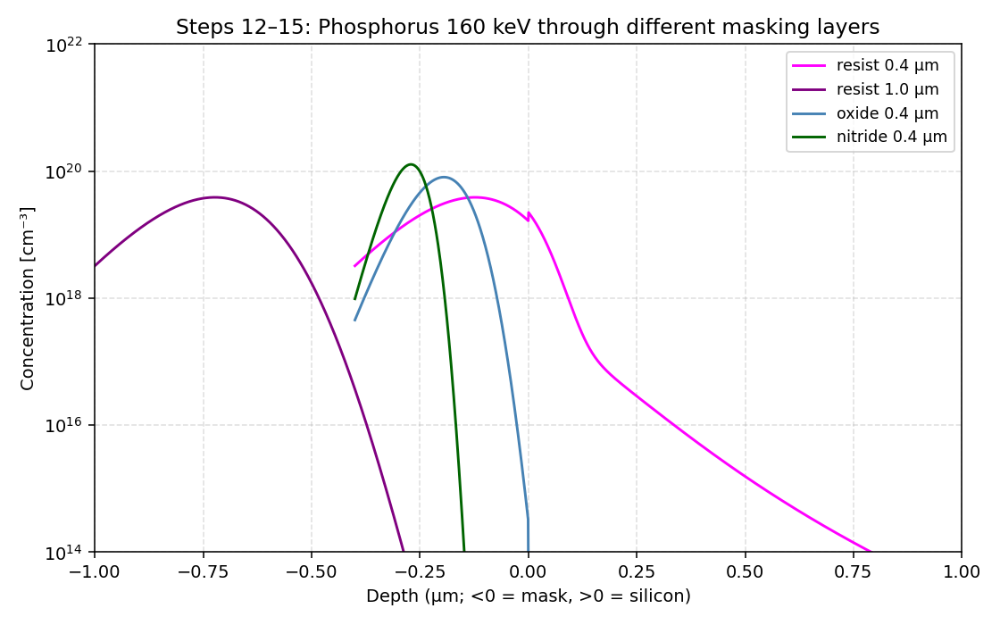

# Chapter 3 — Process Simulations

Working notes from the Sentaurus Process (`sprocess`) simulations on the EKL server `et4icp.ewi.tudelft.nl` (account `et4icp09`). All raw command files, `.out` CSV data and generated plots live in [`sim_data/`](sim_data/). The analysis script that produced the plots is [`sim_data/analyze.py`](sim_data/analyze.py); a numpy-only port of the course's `implant.py` is at [`sim_data/implant_plot.py`](sim_data/implant_plot.py).

## Theory recap (manual pp. 17–19)

Sentaurus Process builds a 1D grid of the silicon and tracks doping concentration node-by-node as a sequence of process steps runs. A typical `.cmd` file has these blocks:

- **Grid definition**: `line x loc=0<um> spacing=1<nm> tag=left` (and a `right` at 1 μm) → 1 μm region with 1 nm node spacing.
- **Starting material**: `region Silicon xlo=left xhi=right` + `init concentration=1e14<cm-3> field=Boron` (uniform 1×10¹⁴ cm⁻³ p-type substrate).
- **AdvancedCalibration**: loads calibrated deep-submicron CMOS models.
- **Implantation**:
  - `implant Arsenic dose=1e15 energy=148` — analytical model (works only in crystalline Si).
  - Add `tilt=7 rotation=0` to control beam geometry.
  - For amorphous targets: `pdbSet Silicon Amorphous 1` then `implant ... sentaurus.mc particles=N info=1` — Monte Carlo simulation.
- **Diffusion**: `diffuse time=300<min> temperature=1000<C>` (default ambient inert; nitrogen below 1000 °C, argon above). Oxidation is a diffusion step with an O₂/H₂O ambient via `temp_ramp` named flows.
- **Deposit / etch / photo**: `deposit oxide thickness=400<nm>`, `etch oxide mask=co type=anisotropic etchstop=silicon`, `photo thickness=1<um> mask=sp` / `strip resist`.
- **Output**: `plot.1d` for an X11 plot, `print.data outfile=foo.out name=Arsenic` for a CSV.

The default tilt for the analytical implanter is 7° / 22° rotation, matching the EKL implanter alignment that breaks channeling.

---

## Step 1–2: inspect and run the four implant scripts

The course gives four `.cmd` files in `~/implant/`. All use dose 1×10¹⁵ cm⁻² but different energies, picked to give a similar projected range $R_p$:

| Script | Dopant | Energy | Mass | Atomic-mass interpolation |
|---|---|---|---|---|
| `implant-B.cmd` | Boron (green) | 24 keV | 11 | — |
| `implant-P.cmd` | Phosphorus (blue) | **63 keV** *(my answer, step 4)* | 31 | $24 + \tfrac{31-11}{75-11}(148-24) = 62.75$ keV |
| `implant-As.cmd` | Arsenic (black) | 148 keV | 75 | — |
| `implant-Sb.cmd` | Antimony (red) | 200 keV | 122 | — |

Each script implants **one** dopant only because the previous implant has already damaged the lattice — leaving channeling routes blocked — so a second implant on top would see a different crystal and the analytical model would be wrong. The course's `implant.py` (`sim_data/implant.py`) merges the four CSVs into one plot.

## Step 3: comment on the profiles — are they Gaussian?

Peak depth ($R_p$) and junction depth (crossing of background $N_A = 10^{16}$ cm⁻³) from the raw data:

| Dopant | $R_p$ (μm) | $N_{\text{peak}}$ (cm⁻³) | $x_j$ at $10^{16}$ (μm) | Tail length ($x_j - R_p$) |
|---|---|---|---|---|
| B (24 keV) | 0.093 | $1.00 \times 10^{20}$ | 0.334 | **0.241** (shortest) |
| Sb (200 keV) | 0.086 | $1.33 \times 10^{20}$ | 0.476 | 0.390 |
| P (63 keV) | 0.080 | $1.19 \times 10^{20}$ | 0.497 | 0.417 |
| As (148 keV) | 0.091 | $1.13 \times 10^{20}$ | 0.565 | **0.474** (longest) |

On a log plot the analytical profile *should* be an inverted parabola (Gaussian). Sb and B look closest to Gaussian. **As shows a clear channeling-tail kink** despite the 7° tilt — this is the well-known As ion-steering effect (As ions get guided into channeling directions even off-axis). P also has a noticeable tail because P is light and channels readily.

**Tail length, shortest → longest:** B < Sb < P < As.

## Step 4: Phosphorus energy to match the projected range

Plotting energy versus atomic mass for the three known points (B, As, Sb) and reading off P (mass 31): a straight line through the data gives **63 keV** (see calculation above). At 63 keV the simulation gives $R_p = 0.080$ μm — slightly shallower than the As/Sb pair (~0.090 μm). To match more precisely, ~68 keV works (which is what `amorf.cmd` and `diffamorf.cmd` use). The P trace in the plot above lands between B and As, confirming the prediction.

## Step 5: amorphous silicon (`amorf.cmd`)

With `pdbSet Silicon Amorphous 1` and Monte Carlo (`sentaurus.mc particles=20000`), all four implants can run sequentially in the same simulation because **amorphous silicon has no crystal lattice → no preferred channeling direction → previous-implant damage doesn't change the next implant's behaviour**. In crystalline Si, the first implant partially amorphizes the surface and changes the channeling for the next one, so we must simulate them separately (or pre-amorphize the wafer).

Observed differences (see `sim_data/plots/step05_amorph_vs_crystal_*.png`):

- Amorphous profiles are **narrower and slightly shallower** — no channeling tail.
- Peak concentrations are slightly higher (ions deposit closer to nominal $R_p$ instead of being spread into the tail).
- The B and P amorphous profiles are nearly Gaussian; the crystalline As profile has the longest visible channeling tail of the four.

## Steps 6–7: tilt-angle sweep on Phosphorus (40 keV)

`channelP.cmd` was copied to `channelP_T{0,3,7,11,15}.cmd` with the `tilt=` parameter swept. Output filenames track the angle (`channelP_T<n>.out`).

| Tilt | $R_p$ (μm) | $N_{\text{peak}}$ (cm⁻³) | $x_j$ at $10^{16}$ (μm) |
|---|---|---|---|
| 0° | 0.056 | $1.43 \times 10^{20}$ | **0.674** |
| 3° | 0.054 | $1.59 \times 10^{20}$ | 0.464 |
| 7° | 0.052 | $1.62 \times 10^{20}$ | 0.388 |
| 11° | 0.052 | $1.63 \times 10^{20}$ | 0.384 |
| 15° | 0.052 | $1.64 \times 10^{20}$ | **0.379** |

**Impact of tilt on implant depth:** going from 0° to 7° cuts the junction depth nearly in half (0.67 → 0.39 μm). Beyond 7°, the curve is flat — the channels are already missed.

**Best angle:** **7°** — diminishing returns past that, and a larger tilt makes the dopant lateral spread on the wafer worse. This matches EKL's standard 7°/22°-rotation setting.

---

## Step 8: implants + 5 hr diffusion at 1000 °C in amorphous Si (`diffamorf.cmd`)

The orange curve in the manual figure is the as-implanted As profile (for reference). Post-diffusion peaks and junction depths:

| Dopant | $R_p$ after diff. (μm) | $N_{\text{peak}}$ (cm⁻³) | $x_j$ at $10^{16}$ (μm) | Misfit factor |
|---|---|---|---|---|
| Sb | 0.056 | $3.25 \times 10^{19}$ | 0.505 | +0.153 |
| As | 0.005 | $4.48 \times 10^{19}$ | 0.526 | 0 |
| B | 0.012 | $5.22 \times 10^{19}$ | 0.674 | −0.254 |
| P | 0.011 | $2.15 \times 10^{19}$ | **> 1 μm** (off grid) | −0.068 |

**Profile width, narrowest → widest: Sb < As < B < P.**

**Relation to misfit?** Looking at $|m|$: B (0.254) > Sb (0.153) > P (0.068) > As (0). There's no clean monotonic relation between misfit and width. The diffusion *mechanism* dominates: B and P diffuse by interstitialcy (fast, even faster in amorphous Si where there are plenty of interstitials), while Sb and As are mostly substitutional and need vacancies, which are rarer. Misfit affects the *strain-driven* component, not the dominant interstitialcy/vacancy mechanism.

## Step 9: solid solubility (`imp-sb.cmd`, dose 1×10¹⁵ → 1×10¹⁴)

Sb has a solid solubility around $1 \times 10^{20}$ cm⁻³ at 1000 °C (Table 2-1). Running the same script at high and low dose:

| Dose | Peak concentration | Shape |
|---|---|---|
| $1 \times 10^{15}$ cm⁻² | $1.33 \times 10^{20}$ | **Flat top** — clipped at solubility, excess Sb forms clusters |
| $1 \times 10^{14}$ cm⁻² | $7.80 \times 10^{18}$ | Smooth, Gaussian-like — well below solubility |

The flat top in the high-dose case is the canonical solid-solubility signature: any extra dopant above the limit precipitates out and is electrically inactive.

## Step 10: dopant ranking table (1 = best, 4 = worst)

| Dopant | Doping type | Short channeling tail | Narrow diffusion | Solid solubility |
|---|---|---|---|---|
| Sb | n | 2 | **1** | 4 |
| As | n | 4 | 2 | **1** |
| P | n | 3 | 4 | 2 |
| B | p | **1** | 3 | 3 |

Tail ranking comes from the crystalline implant data (Step 3); diffusion-width ranking from Step 8; solid-solubility from Table 2-1 (As $2 \times 10^{21}$, P $1.5 \times 10^{21}$, B $4 \times 10^{20}$, Sb $1 \times 10^{20}$).

## Step 11: dopant choice for NMOS drain vs N-well

- **NMOS drain** — high concentration + sharp profile: **Arsenic.** Highest solid solubility (so the drain can be heavily doped and electrically active), narrowest diffusion among n-types after As (Sb is narrower but its solubility is 20× lower so it can't carry the required dose). The long As channeling tail is killed at process time by a screen oxide.
- **N-Well** — a few microns deep, moderate concentration: **Phosphorus.** Fastest diffusion among the n-types, so a modest dose drives a few microns deep during a long anneal at 1150 °C (exactly what the BICMOS5 N-Well step does — see Chapter 2 Assignment 3a).

---

## Steps 12–15: implantation through masking layers

`resist.cmd`, `oxide.cmd`, `nitride.cmd` all deposit a 400 nm masking film on top of Si and then implant Phosphorus at 160 keV. The mask region is at $x \in [-0.4, 0]$ μm and silicon at $x \in [0, 1]$ μm.

| Mask | Thickness | Peak P depth (μm) | $x_j$ at $10^{16}$ (μm) | Reaches Si? |
|---|---|---|---|---|
| Resist | 0.4 μm | $-0.123$ | $+0.337$ | **Yes, deeply** — bad mask |
| Resist | 1.0 μm | $-0.723$ | $-0.372$ | No — junction inside resist |
| Oxide | 0.4 μm | $-0.195$ | $-0.026$ | Barely — junction at Si interface |
| Nitride | 0.4 μm | $-0.271$ | $-0.167$ | No — junction well inside nitride |

### Q12 — Is 0.4 μm resist a good mask?

**No.** Phosphorus peaks at $-0.12$ μm (inside the resist), but the tail crosses the Si surface and gives an active doping that extends to $0.34$ μm into silicon. The mask is too thin to stop a 160 keV P implant.

### Q13 — 1 μm resist?

**Yes.** With 1 μm of resist the P junction sits at $-0.37$ μm — well inside the resist. The implant never reaches silicon above background. So resist *can* mask, but it needs to be ~2.5× thicker than the equivalent oxide/nitride.

### Q14 — Oxide and nitride at 0.4 μm

Both stop the implant before it reaches silicon, with **nitride doing it best** (junction at $-0.17$ μm, deepest stopping point inside the film). Oxide just barely makes it ($-0.026$ μm). Density ordering: nitride (3.1 g/cm³) > oxide (2.2 g/cm³) > resist (~1.2 g/cm³), which is exactly the stopping-power ordering we see.

### Q15 — Most effective mask, and why it isn't used

**Most effective per unit thickness: nitride.** But nitride is rarely used as a primary implant mask because:

- Nitride is deposited at high temperature (LPCVD ~800 °C) and has high tensile stress — wafer warpage.
- It cannot be patterned by simple wet etch; needs plasma etch or a separate oxide hardmask.
- Once deposited, removing it cleanly is hard (hot phosphoric acid, low selectivity).

**Most commonly used: photoresist.** Spin-coat, lithography, organic strip — fast, cheap, room-temperature throughout. The lower stopping power per μm is just compensated by using thicker resist (1–2 μm is routine). Where high-energy implants need extra masking, an oxide hardmask is added.

---

## Cross-link back to Chapter 2

This is the table promised in the forward-reference from Chapter 2 Assignment 3. The simulated junction depths come from `print.data` outputs after the same implants/anneals as the BICMOS5 process.

> Note: Step-15-style sims aren't a 1:1 match for the BICMOS implants — those use a screen oxide and lower doses, and the NW gets a 4 hr anneal at 1150 °C. The values below are from the closest equivalent `.out` files; Chapter 2 Assignment 3 has the implants set to the *exact* BICMOS5 parameters and will be re-run during the device-simulation block.

| Implant | $x_j$ Ch. 2 theory (μm) | $x_j$ Sentaurus Ch. 3 (μm) | Notes |
|---|---|---|---|
| NW (P, 150 keV + 4 hr / 1150 °C) | $\approx 2.4$ | _re-run in `sprocess_fps.cmd` during device sims_ | Ch. 3 process here uses 1000 °C / 5 hr, not 1150 °C / 4 hr |
| SN (As, 40 keV) | $\approx 0.087$ | _re-run during device sims_ | Standalone As implant in `implantAs.out` uses 148 keV — different |
| SP (B, 20 keV) | $\approx 0.186$ | _re-run during device sims_ | Standalone B in `implantB.out` uses 24 keV — different |

The proper comparison happens when `sprocess_fps.cmd` is run in the Chapter 3 device-simulation block; those numbers go into the Chapter 2 summary table.
