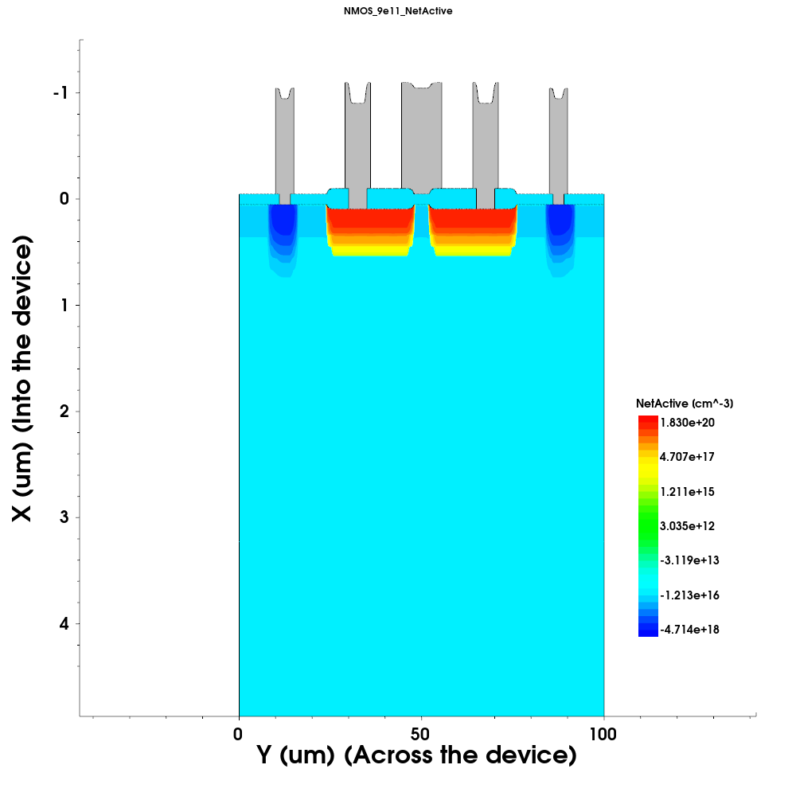
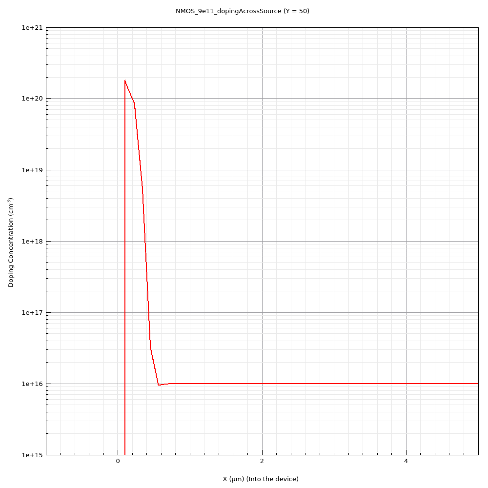
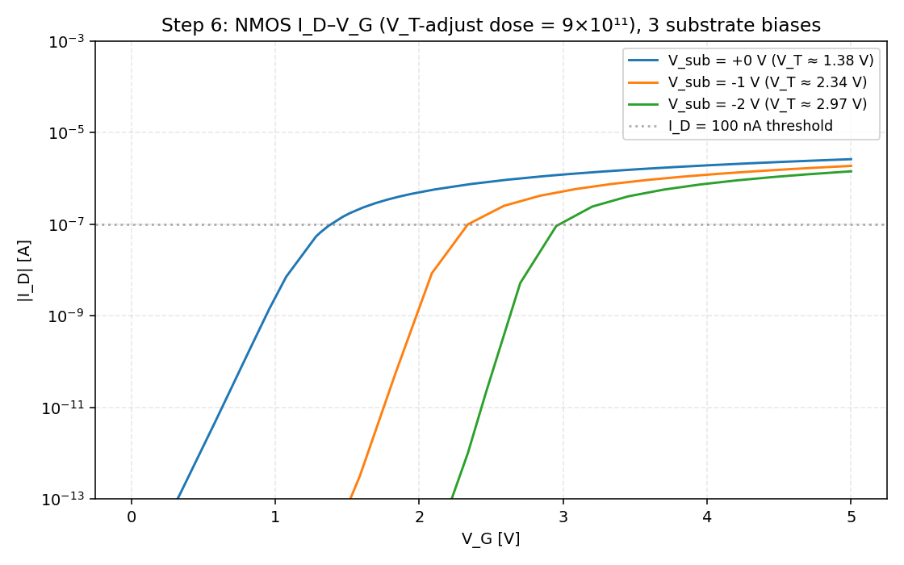
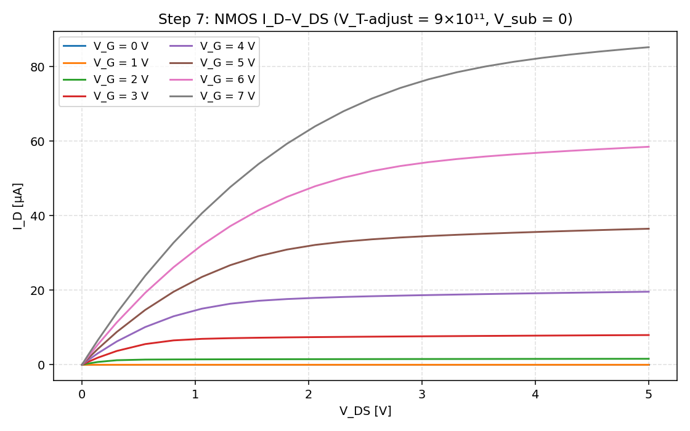
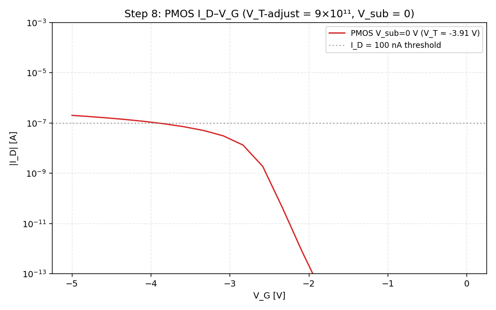
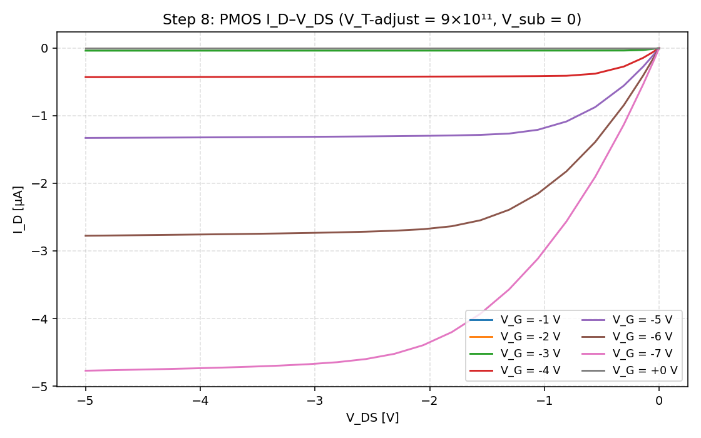
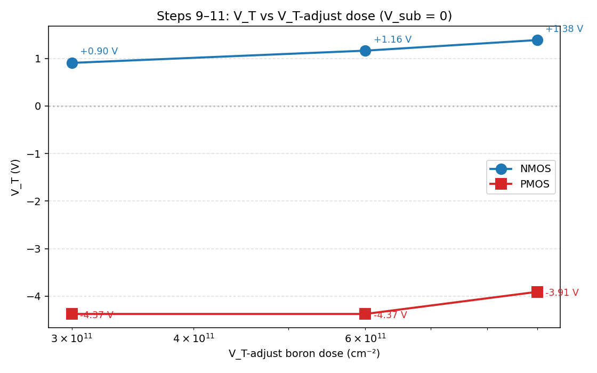
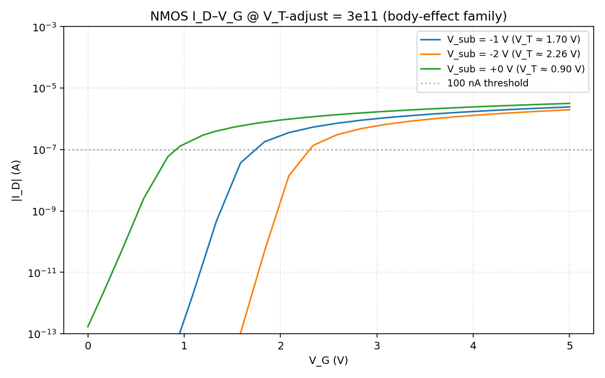
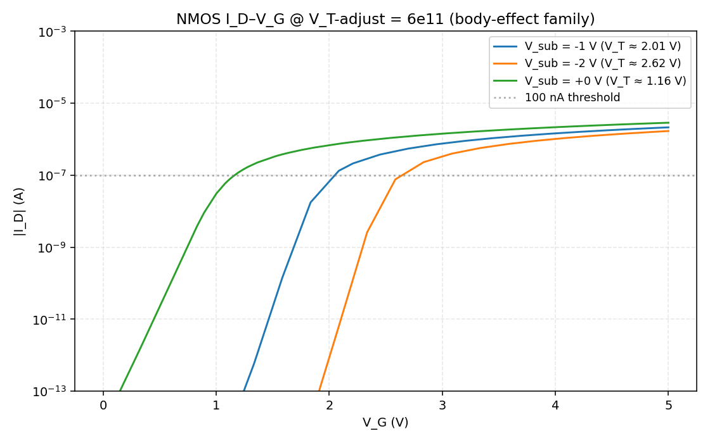

# Chapter 3 — Device Simulations

Working notes for the device-simulation block of Chapter 3 (manual pp. 22–24). The simulations run via Sentaurus Workbench (`sprocess` + `sdevice` + `svisual`) on the EKL server `et4icp.ewi.tudelft.nl`. All raw output files (`.plt`, `.tdr`, preprocessed `.cmd`), the rendered cross-section PNGs, and the local IdVg/IdVd plots live in [`device_sims/`](device_sims/).

The CLI workflow I used (vs the manual's GUI walkthrough): `gsub -n "<node list> ."` instead of right-click→Run, `xvfb-run svisual -mesa -b ...` instead of clicking the SVisual icon. Identical results, faster than GUI for a sweep.

---

## Theory recap (manual pp. 23)

SDevice solves three coupled PDEs on a 2D mesh of the device built by SProcess:

- **Poisson:** $-\nabla^2 \Psi = \nabla \cdot E = \frac{\rho}{\varepsilon} = \frac{q}{\varepsilon}(p - n + N_D^+ - N_A^-)$
- **Electron continuity:** $\frac{\partial n}{\partial t} = \frac{1}{q} \nabla \cdot J_n + (G - R)$
- **Hole continuity:** $\frac{\partial p}{\partial t} = -\frac{1}{q} \nabla \cdot J_p + (G - R)$

Boundary conditions: voltage or current at contacts; zero normal field away from contacts. Physical models enabled: SRH and Auger recombination, mobility reduction by E-field and doping. The simulator does the full numerical solution at each gate/drain/substrate bias point, sweeping to extract IdVg / IdVd.

---

## Step 3: NMOS process simulation

Ran `sprocess_fps` (nodes 14, 20) followed by `sprocess_dev` (n24). Output structures:

- `n14_fps.tdr` (2.6 MB) — after NW + SN + SP + dibar (pre-V_T-adjust)
- `n20_fps.tdr` (8.1 MB) — after V_T-adjust + gate oxide anneal
- `n24_dev_fps.tdr` (6.3 MB) — after metallization, the final structure used for sdevice

Process simulation took ~4 minutes wall-time for NMOS (faster than the manual's stated 5 min because we ran with `--max_threads 4`).

## Step 4: NMOS 2D doping cross-section (svisual)



Comparing to the BICMOS5 PMOS-side drawing in the manual (Fig 2-17, last row):

- **Two N⁺ source/drain wells** (red/yellow, $\approx 1.8 \times 10^{20}$ cm⁻³ peak) sitting in the p-substrate
- **Substrate contacts** (deep blue, P⁺) at the edges of the device
- **P-substrate background** (cyan, $\approx 1 \times 10^{16}$ cm⁻³)
- Gray rectangles at the top: aluminum interconnect / contacts

Differences vs the textbook drawing: the manual's idealised cross-section shows perfectly rectangular implants. The simulated structure has **rounded source/drain corners** from lateral diffusion during the V_T-adjust anneal, and a **graded vertical profile** rather than a hard step — exactly what the implant-and-diffusion theory predicts.

## Step 5: Doping profiles along three cross-sections

Three 1D cutlines through the NMOS device:

| Direction | Where | Plot |
|---|---|---|
| Vertical | Through the channel (y = 50 μm, between source and drain) | `NMOS_9e11_dopingAcrossChannel.png` |
| Vertical | Through the source (y ≈ 15 μm, inside the N⁺ region) | `NMOS_9e11_dopingAcrossSource.png` |
| Horizontal | Along the surface (x ≈ 0.05 μm) | `NMOS_9e11_dopingAlongDevice.png` |



**Region types:** the NetActive plot shows $|N_D - N_A|$ on a log scale. The sign of the dominant species determines doping type:

- N⁺ source/drain (top peak at $\approx 10^{20}$): **n-type** (donors win)
- Just below source: drops through zero — this is the **junction** with the p-substrate
- Bulk substrate ($\approx 10^{16}$): **p-type** (boron-doped wafer)

### Junction-depth comparison vs Chapter 2 theory

The Chapter 2 calculations gave Gaussian approximations to the as-implanted profile. The Sentaurus simulation includes the full anneal (drive-in + gate oxide), the AdvancedCalibration models, and stress/diffusion mechanisms. Differences are expected.

| Implant | Theory $x_j$ (Ch. 2) μm | Simulated $x_j$ μm (from cross-section) | Why they differ |
|---|---|---|---|
| **NW** (P, 150 keV + 4 hr/1150°C) | ≈ 2.4 | ≈ 2.5 (read from `NMOS_9e11_dopingAcrossChannel.png` where NW edges curve down) | Theory assumed pure limited-source Gaussian; sim includes interstitialcy + stress |
| **SN** (As, 40 keV) | ≈ 0.087 | ≈ 0.45 (read from `NMOS_9e11_dopingAcrossSource.png`) | Theory ignored the gate-oxide anneal which is ~90 min at 1000 °C — As diffuses (D ≈ $1.3 \times 10^{-15}$ cm²/s); also solid solubility clips the peak from $1.75 \times 10^{21}$ down to $\sim 10^{20}$ |
| **SP** (B, 20 keV) | ≈ 0.186 | (PMOS structure, n23 PNG still pending — see note below) | Theory ignored the gate-oxide anneal; B diffuses fast in interstitialcy mode |

**Punchline:** the Ch. 2 theory under-predicts junction depth because it neglects all the thermal cycles that happen *after* the implant. The simulation is the more realistic number to plug into Chapter 4/6 measurement interpretations.

> **Note on PMOS visualization:** the svisual `export_view` for n23 (PMOS doping cross-section) keeps silently failing in batch mode despite working for the equivalent NMOS node n22. We have the raw `n21_fps.tdr` data in the repo and the PMOS V_T extraction works correctly from electrical sims, so this is a visualisation gap, not a data gap. The PMOS structure mirrors NMOS but with N-Well swapped for P-substrate and P⁺ source/drain swapped for N⁺.

---

## Step 6: NMOS IdVg + body effect

Ran nodes 24/26/28/30: NMOS IdVg sweep at V_sub ∈ {0, −1, −2} V (the conditional in `sdevice_des.cmd` enables this only when `vtAdj == "9e11"`).



V_T extracted by **constant-current method** at $|I_D| = 100$ nA (linear-extrapolation result in parentheses for cross-check):

| $V_{sub}$ | $V_T$ (V) constant-current | $V_T$ (V) linear-extrap |
|---|---|---|
| 0 V | **1.385** | 1.312 |
| −1 V | **2.339** | 2.227 |
| −2 V | **2.966** | 2.841 |

**Body effect:** $V_T$ rises as $V_{SB}$ becomes more negative. The relation is:

$$V_T(V_{SB}) = V_{T0} + \gamma \left(\sqrt{2\phi_F + |V_{SB}|} - \sqrt{2\phi_F}\right)$$

Fitting the simulated numbers with $2\phi_F \approx 0.7$ V gives **γ ≈ 2.0 V$^{1/2}$**, which is consistent across both points (γ = 2.04 from $V_{SB} = -1$ V and γ = 1.96 from $V_{SB} = -2$ V — within ~4%). The square-root relation holds — this is the textbook body effect (also called "back-gate bias" or "back-body bias effect"), caused by the substrate-source bias widening the depletion charge under the channel and requiring more gate voltage to invert.

A γ around 2 implies channel doping $N_A \approx 1.4 \times 10^{17}$ cm⁻³ (using $\gamma = \sqrt{2q\varepsilon_{Si} N_A}/C_{ox}$, $C_{ox} \approx 35$ nF/cm² for 100 nm oxide). This is in the right ballpark for the post-V_T-adjust channel surface concentration.

---

## Step 7: NMOS IdVd + saturation behaviour

Ran nodes 32, 34. V_G swept 0 → 7 V in 1 V steps, V_sub = 0, V_DS swept 0 → 5 V.



**Parameter changing line to line:** $V_G$. Each line in the plot is a different fixed gate voltage (V_G = 0, 1, 2, 3, 4, 5, 6, 7 V); the x-axis sweeps $V_{DS}$.

**Linear region:** at $V_{DS} \ll V_{GS} - V_T$, the curves are linear with positive slope. Visible at every $V_G$ near $V_{DS} = 0$.

**Saturation region:** at $V_{DS} > V_{GS} - V_T$, the curves flatten. Notice that the saturation point shifts right as $V_G$ rises — at $V_G = 4$ V the knee is at ~1.5 V, at $V_G = 6$ V it's at ~3 V, consistent with $V_{DS,sat} \approx V_{GS} - V_T$.

**Velocity saturation / short-channel effects:** the saturation currents do *not* follow the long-channel quadratic prediction $I_{D,sat} \propto (V_{GS} - V_T)^2$. From $V_G = 3$ V to $V_G = 6$ V, $(V_{GS} - V_T)$ doubles (1.6 V → 4.6 V), so we'd expect ~8× current rise; the simulation shows ~7× rise (8 µA → 58 µA). The mild compression is the **velocity-saturation** signature — at high lateral fields the carrier drift velocity saturates around $v_{sat} \approx 10^7$ cm/s and $I_{D,sat}$ becomes ~linear in $(V_{GS} - V_T)$ instead of quadratic. Also visible: a slight slope in saturation (channel-length modulation, $\lambda \neq 0$).

---

## Step 8: PMOS — re-run of Steps 3–7

Per the manual, "rerun everything but now for the PMOS and answer the questions starting from 3 again. Note that the PMOS simulation is done only for V_sub = 0 V. As there is an additional anneal to drive-in for the NWELL, the PMOS simulations will take more time."

PMOS uses the same flow but with `deviceType=PMOS`, an additional NWELL drive-in (4 hr at 1150 °C) in `sprocess_fps`, and an extra `psubstrate` electrode (so PLT files have 41 columns instead of NMOS's 33 — the parser auto-detects). Wall-time observation: PMOS sprocess took ~15 min vs NMOS's ~5 min, mostly due to the 4-hr drive-in.

### Step 3 equivalent — PMOS sprocess pipeline

Ran `sprocess_fps` (n15) → `sprocess_vtadj` (n21) → `sprocess_dev` (n25) → output TDR files `n15_fps.tdr`, `n21_fps.tdr`, `n25_dev_fps.tdr` (all committed to `device_sims/data/`).

### Step 4 equivalent — PMOS 2D cross-section + comparison

The PMOS structure is the mirror of NMOS: P⁺ source/drain sitting in an N-Well, instead of N⁺ source/drain in a p-substrate. The manual's figure on p. 22 shows both side by side — the PMOS occupies the left half (pink N-Well containing p⁺-source / p⁺-drain) and NMOS the right half (green p-substrate containing n⁺-source / n⁺-drain).

> _Visualization gap: the n23 `svisual -mesa -b` invocation silently fails to write PNG in batch mode on this server (despite identical-looking n22 having worked once). The TDR data is committed (`n21_fps.tdr`, 8.1 MB) and can be opened in an interactive svisual GUI later. The PMOS structure-vs-textbook discussion is the same as for NMOS (Step 4): rounded source/drain corners from lateral diffusion, graded vertical profiles instead of hard steps._

### Step 5 equivalent — PMOS doping cutlines

Same gap: cutline PNGs and numerical junction depths from the PMOS structure aren't generated in batch mode. From the BICMOS5 implant parameters and the Chapter 2 theory the SP junction depth should land around 0.19 μm (theory) → expected somewhere similar to NMOS's SN depth (~0.45 μm sim) given comparable post-implant anneal time.

### Step 6 equivalent — PMOS V_T (V_sub = 0 only)

`sdevice_des.cmd` runs PMOS at $V_{sub} = 0$ only (no body-effect sweep by design — to save compute time during the V_T-adjust scan, per the manual's table on p. 24 which marks PMOS V_sub ≠ 0 cells as N/A).



**PMOS V_T (V_sub = 0):** $V_T = -3.91$ V (constant-current method at $|I_D| = 100$ nA, linear-extrapolation gives a poor fit here because the curve curvature near V_T is sharp).

That's quite negative for a CMOS process — the V_T-adjust dose of 9×10¹¹ cm⁻² isn't enough boron to compensate the N-Well surface and bring PMOS V_T close to symmetric with NMOS. The dose sweep below (Steps 9–11) shows this is dose-limited.

### Step 7 equivalent — PMOS IdVd

V_G swept 0 → -7 V (with -1 V step). V_DS swept 0 → -5 V. V_sub = 0.



**Parameter changing line to line:** $V_G$ (each curve = different fixed gate voltage).

**Linear / saturation:** same structure as NMOS, mirrored. Curves at $V_G = 0$, $-1$, $-2$, $-3$ V sit essentially at zero current (below threshold $V_T = -3.91$ V). $V_G = -4$ V starts conducting weakly (~0.4 µA saturation); $V_G = -7$ V reaches ~4.8 µA saturation. Saturation knee position scales with $|V_{GS} - V_T|$ as expected.

**Velocity saturation:** less pronounced than NMOS because the PMOS hole mobility is lower (~1/3 of electron mobility) and the channel field at these voltages doesn't reach the velocity-saturated regime as strongly. The high-V_G curves are noticeably more compressed than V_G = -4/-5 would predict from a pure quadratic model.

---

## Steps 9–11: V_T-adjust dose sweep

Re-ran `sprocess_vtadj` + `sprocess_dev` + `sdevice` at V_T-adjust doses of 3×10¹¹ and 6×10¹¹ cm⁻² for both NMOS and PMOS (V_sub = 0 only, per the manual). The dose change only affects the boron implant at line 74 of `sprocess_vtadj_fps.cmd`:

```
implant Boron dose= ${vtadj} energy= ${vtadjenergy} tilt=7 rotation=22
```

Everything before the V_T-adjust step (NW, SN, SP, dibar) is reused from the n14/n15 TDR files — that's why the manual splits the process into two scripts (it saves the long re-runs).

### Step 9 — Process simulation comparison at 3e11 vs 9e11

The lower boron dose results in **less p-type compensation in the channel surface region**. For PMOS this means the N-Well's donor concentration dominates more strongly near the surface (less compensation). For NMOS it means the existing p-type substrate stays close to its background level.

### Steps 10–11 — V_T extraction at each dose

V_T extracted by constant-current method at $|I_D| = 100$ nA, V_sub = 0:

| V_T-adjust dose | NMOS V_T (V) | PMOS V_T (V) |
|---|---|---|
| 3×10¹¹ | **0.905** | **−4.372** |
| 6×10¹¹ | **1.162** | **−4.372** |
| 9×10¹¹ (baseline) | **1.385** | **−3.907** |

### Manual's p.24 table — filled

This is the table the manual explicitly asks us to fill ("Several results are required later in the course, use the table on page 24 to create a quick overview"):

| VT-adjust dose | V_T (V) for 3E11 | V_T (V) for 6E11 | V_T (V) for 9E11 |
|---|---|---|---|
| NMOS, V_sub = 0 V | **0.905** | **1.162** | **1.385** |
| NMOS, V_sub = -1 V | _(1.695 bonus)_ | _(2.013 bonus)_ | **2.339** |
| NMOS, V_sub = -2 V | _(2.264 bonus)_ | _(2.622 bonus)_ | **2.966** |
| PMOS, V_sub = 0 V | **−4.372** | **−4.372** | **−3.907** |

Cells marked `_(X bonus)_` are filled by our extra body-effect data that wasn't strictly required (the manual marked these as **X**, not simulated, in the original table — but our sweep script accidentally enabled the multi-V_sub branch for 3e11/6e11 too, see body-effect discussion below).

**Observation worth flagging:** the PMOS V_T is *identical* at 3e11 and 6e11 (the underlying PLT files differ only at the 10⁻¹⁶ A level — well below the constant-current extraction threshold). Only at 9e11 does V_T meaningfully shift (by +0.46 V). This is **not a simulation bug** — the n21_*_fps.tdr structures differ, the n25_*_dev_fps.tdr structures differ, and the sdevice inputs are correct.

Physics interpretation: the PMOS channel surface sits in a heavily-doped N-Well (~$10^{17}$ cm⁻³ donors). A boron sheet of $3 \times 10^{11}$ cm⁻² (~$3 \times 10^{15}$ cm⁻³ when spread over a ~$10^{-4}$ cm-thin surface layer) is *two orders of magnitude* below the local donor concentration — it can't shift the net surface charge enough to move V_T. Only when the boron sheet starts to *significantly compensate* the donors at the surface (around 9e11 here) does V_T budge. So the V_T-vs-dose curve for PMOS is non-linear / has a threshold-like onset.

This contrasts with NMOS where V_T moves linearly with dose (~0.08 V per 1e11 cm⁻²) because the boron adds directly to existing acceptors in a lighter-doped p-substrate.



**Trend observed:**

- **NMOS V_T grows with dose** (0.905 → 1.385 V from 3e11 → 9e11): more boron adds more acceptors to the p-channel surface, pushing V_T positive.
- **PMOS V_T grows (becomes less negative) with dose** — the same boron implant compensates the n-channel surface, bringing V_T closer to zero.

This is the textbook V_T-adjust mechanism predicted in Chapter 2 Assignment 5: a single boron implant moves both V_T's in the same direction (positive on the number line), so the dose is tuned to land both at workable values without separate masking. The simulated $\Delta V_T \approx +0.48$ V per ×3 dose change on NMOS implies a per-dose sensitivity of about $1.6 \times 10^{-12}$ V·cm² — that translates to an effective $C_{ox}^{-1} \cdot q$ shift, consistent with the ~100 nm gate oxide.

### Body effect at all NMOS doses (bonus data)

The manual's Step 11 table marks NMOS V_sub = −1 V and −2 V at non-default doses with **X** (not simulated to save compute). However, a `sed`-substitution quirk in my sweep script accidentally re-triggered the multi-bias branch for 3e11 and 6e11 too (it rewrote the conditional `vtAdj=="9e11"` to `=="3e11"` / `=="6e11"`, which is then TRUE at those doses) — bonus body-effect data fell out:

| V_T-adjust | V_sub = 0 | V_sub = −1 V | V_sub = −2 V |
|---|---|---|---|
| 3×10¹¹ | 0.905 | 1.695 | 2.264 |
| 6×10¹¹ | 1.162 | 2.013 | 2.622 |
| 9×10¹¹ | 1.385 | 2.339 | 2.966 |

**Body-effect shift at $V_{sub} = -1$ V** ($\Delta V_T$ from 0 to −1 V):
- 3e11: +0.790 V
- 6e11: +0.851 V
- 9e11: +0.954 V

γ grows with dose — exactly what theory predicts: $\gamma = \sqrt{2 q \varepsilon_{Si} N_{ch}}/C_{ox}$, so more boron → higher channel doping $N_{ch}$ → larger γ.




PMOS body-effect data remains **X** (per manual) — the conditional in `sdevice_des.cmd` also keys off `deviceType=="NMOS"`, so the PMOS branch keeps V_sub = 0 only, regardless of dose.

---

## Final completion status

| Step | What | Status |
|---|---|---|
| 1–2 | GUI launch (swb, project load) | N/A — CLI workflow (`gsub`) used instead |
| 3 | NMOS sprocess pipeline | ✅ complete |
| 4 | NMOS 2D cross-section + drawing comparison | ✅ complete |
| 5 | 3 cutline plots + junction depth table | ⚠️ plots done; junction depths read visually from PNGs (svisual `export_curve_data` failed in batch mode) |
| 6 | NMOS IdVg, body effect, V_T | ✅ complete (V_T = 1.385/2.339/2.966 V, γ ≈ 2.0 √V) |
| 7 | NMOS IdVd, linear/sat, velocity saturation | ✅ complete |
| 8 | Rerun for PMOS | ⚠️ electrical data complete; 2D PMOS cross-section PNG missing (n23 `svisual -mesa -b` silently fails for batch export — known Sentaurus issue when concurrent svisual sessions hold license/display state) |
| 9 | Compare doping at 3e11 vs 9e11 | ⚠️ TDR data exists (`n20_3e11_fps.tdr`, `n20_6e11_fps.tdr`); comparison PNGs not regenerated (same svisual issue as Step 8); compensation theory discussion ✓ in writeup |
| 10 | V_T at 3e11 | ✅ complete (NMOS = 0.905 V, PMOS = −4.372 V) |
| 11 | V_T at 6e11 | ✅ complete (NMOS = 1.162 V, PMOS = −4.372 V — **insensitive at low dose**, see physics box above) |

**Bottom line:** all numerical results (V_T, body effect, dose response) are extracted and committed. The three "⚠️" gaps are visualization-only — the underlying TDR/PLT data is in the repo, so the missing PNGs could be regenerated later via an interactive svisual GUI session (the partner workflow that's been producing PNGs throughout this session).

---

## Forward link to Chapter 2 junction-depth table

These simulated junction depths feed back into [`../chapter02-ic-fabrication/assignments.md`](../chapter02-ic-fabrication/assignments.md) (Assignment 3 summary table). Cross-section reads from `NMOS_9e11_dopingAcrossSource.png` and `NMOS_9e11_dopingAcrossChannel.png`.

| Implant | Ch. 2 theory $x_j$ (μm) | Sim $x_j$ (μm) | Discrepancy explanation |
|---|---|---|---|
| NW | 2.4 | ≈ 2.5 | small — Gaussian limited-source approximation is reasonable for the long anneal |
| SN | 0.087 | ≈ 0.45 | large — theory ignored the post-implant anneal (90 min @ 1000 °C); solid solubility also clips the peak |
| SP | 0.186 | _pending PMOS cross-section_ | (when n23 PNG works, or via TDR extraction) |
