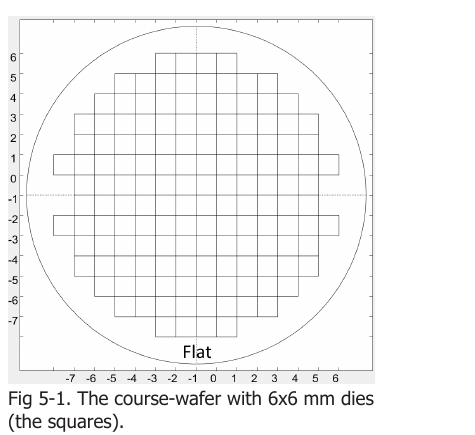
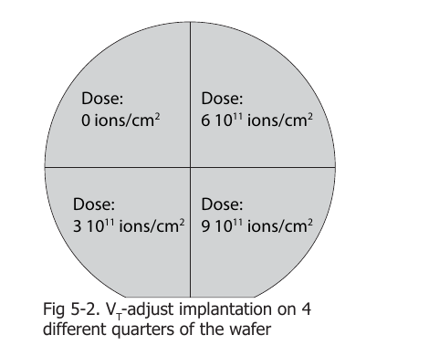
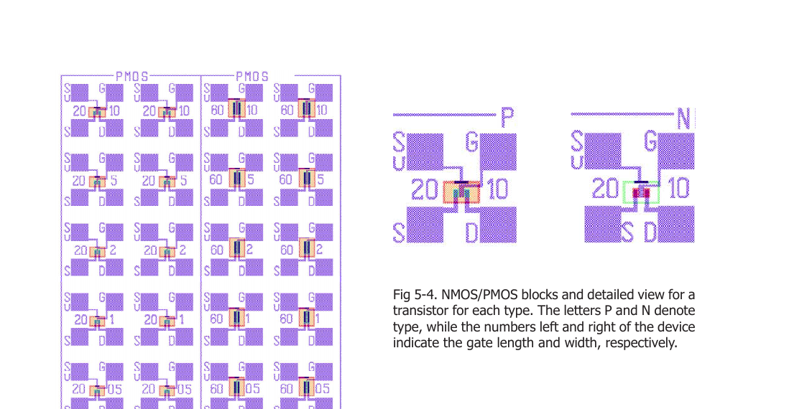
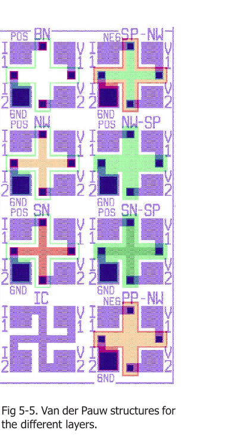
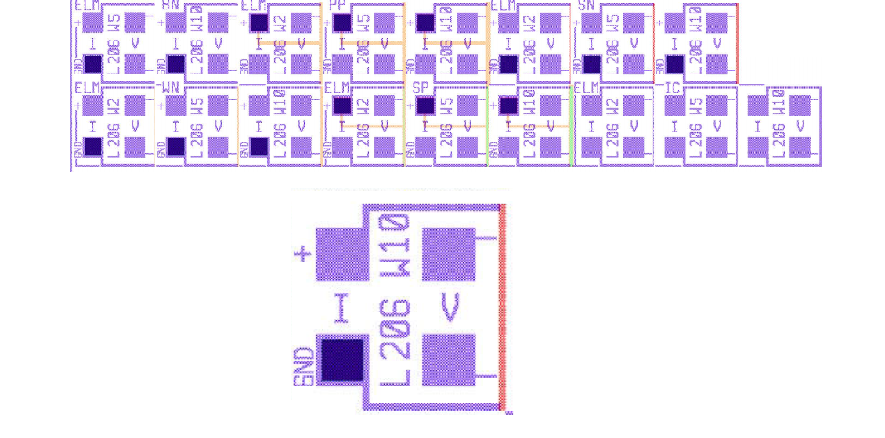

# Chapter 5 — Wafer Layout

Reference notes extracted from Chapter 5 of the ET4icp manual (pages 33–36). This chapter describes the course wafer and the test devices on it. The devices are used to determine the results of the process steps on device performance, or the effect of a process step on a specific layer (e.g. implantation on the resistance of silicon). The theory behind the structures is covered in Chapter 6 (Measurements).

---

## The wafer

- 10 cm wafer, processed at the Else Kooi Laboratory (EKL).
- Contains over 160 dies (chips) of 6 × 6 mm.

### V_T-adjust quarters

The wafer is divided into 4 quarters, each with a different V_T-adjust implantation (boron). The influence of this implantation on the devices is one of the things to investigate.

| Quarter | V_T-adjust dose |
|---|---|
| Top left | 0 ions/cm² |
| Top right | 6×10¹¹ ions/cm² |
| Bottom left | 3×10¹¹ ions/cm² |
| Bottom right | 9×10¹¹ ions/cm² |

## The die

Die size is 6000 × 6000 µm. Each die contains several blocks; only part of them is measured in this course:

- **PMOS transistor block**
- **NMOS transistor block**
- **Electrical linewidth measurement (ELM) structures** (differential resistors)
- **Van der Pauw structures**

Every colour in the die layout depicts a different mask. Mask legend (purposes from Table 2-3 of the manual, BICMOS5 process):

| Mask | Main purpose |
|---|---|
| Zero Layer | Alignment marks for the waferstepper |
| NW (N-well) | n-type area for the PMOS transistor; collector of the bipolar transistor |
| SN (Shallow-N) | n-type source/drain for the NMOS; emitter + low-resistance collector contact of the bipolar; n-type guard ring |
| SP (Shallow-P) | p-type source/drain for the PMOS; base of the bipolar; p-type guard ring |
| CO | Contact openings |
| IC | Interconnect and gate material |

## PMOS and NMOS blocks

- The PMOS block contains 20 PMOS transistors with different gate lengths (20 and 60 µm) and gate widths (0.5, 1, 2, 5 and 10 µm).
- Below the PMOS block is the NMOS block with the same gate lengths and widths.
- In the layout, the letters **P** and **N** denote the transistor type; the numbers left and right of the device indicate the gate **length** and **width**, respectively (e.g. `20 P 10` = PMOS, L = 20 µm, W = 10 µm).
- For both transistor types the **output** and **transfer characteristics** are measured, from which the key transistor properties are extracted.

## Resistors

- In ICs many resistors are made by implanting a strip within the bulk silicon and contacting it from both ends.
- For electrical isolation, the strip is implanted in a region doped with the **opposite** dopant type, so it is surrounded by a PN junction that is non-conductive under reverse bias. ⚠ If the junction becomes forward biased, electrons flow through the entire substrate.
- Resistors with a large range of values (up to several kΩ) are made by reusing the implantations of the transistor process: an area implanted during SP has a higher resistance than a similar area implanted during SN, because SN has the higher implantation dose.
- The resistance scales directly with implantation dose (see implantation in Chapter 2 and sheet resistance in Chapter 4).

## Van der Pauw structures

- Located below the NMOS block: **greek cross** Van der Pauw structures, a fast way of measuring the resistance of a certain implantation or layer.
- Widely used in practice because **contact resistance and probe-needle resistance cancel out**.
- Structure: a 30 µm × 30 µm square of the implantation/layer to be measured, with a contact on each side of the square.
- Measurement: current is imposed on two contacts; the other two contacts measure the resulting voltage drop. The sheet resistance is calculated from these values (explained in Chapter 6).
- Structures exist for the different layers and layer combinations (labels in fig 5-5: BN, SP-NW, NW, NW-SP, SN, SN-SP, IC, PP-NW).

## Electrical linewidth measurement (ELM) structures

- Used to measure the **sheet resistance of an implanted area for different resistor length/width ratios**.
- Of each implantation there are **three resistors**, with widths **2 µm, 5 µm and 10 µm**.
- Each differential resistor has **four contacts**: the outermost contacts impose a current through the resistor; two of the remaining contacts measure the voltage drop over a certain length of the strip.
- Strip length: **206 µm**.
- Labelling: the mask the structure belongs to is indicated by two capital letters (e.g. SN, SP, IC); the number after `W` denotes the line width (e.g. `W10` = 10 µm wide).
- Purpose: determine the **lateral diffusion** of the dopants (explained in Chapter 6).

---

## Quick reference — what each structure is for

| Structure | Geometry | Measures |
|---|---|---|
| NMOS/PMOS transistors | L = 20, 60 µm; W = 0.5, 1, 2, 5, 10 µm | Output & transfer characteristics → key transistor properties; V_T vs implant dose |
| Van der Pauw (greek cross) | 30 × 30 µm square, 4 contacts | Sheet resistance of a layer (contact/probe resistance cancels) |
| ELM (differential resistors) | L = 206 µm; W = 2, 5, 10 µm; 4 contacts | Sheet resistance vs L/W ratio → lateral diffusion of dopants |
| Implanted resistors | Strips isolated by reverse-biased PN junction | Resistance up to several kΩ, scaling with implant dose (SP > SN) |
