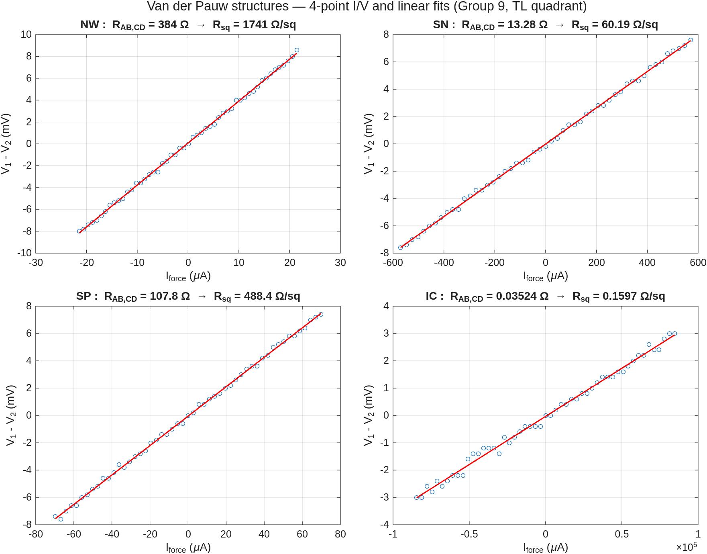
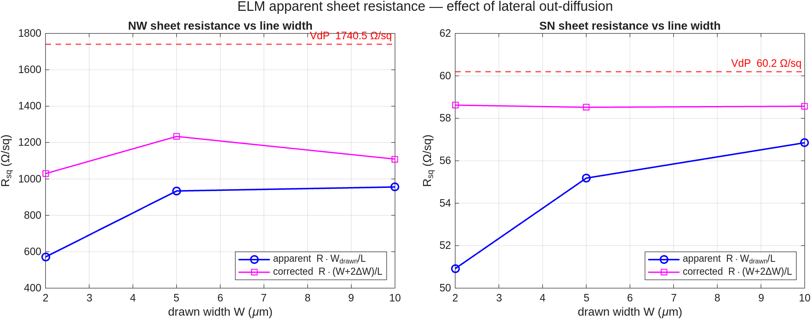
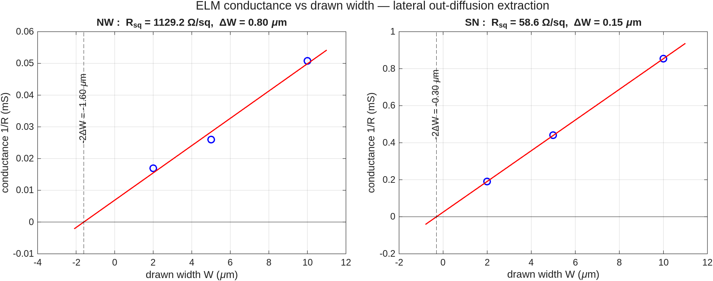
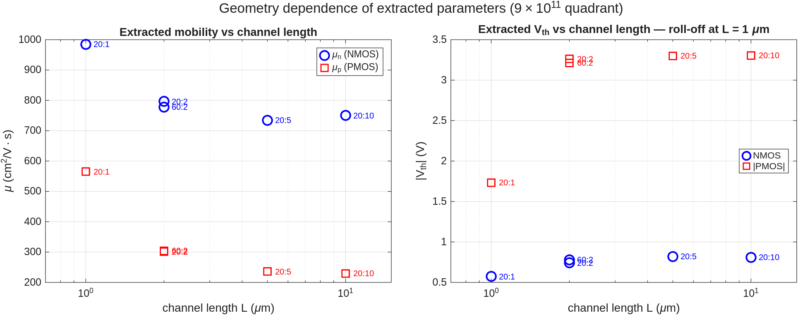
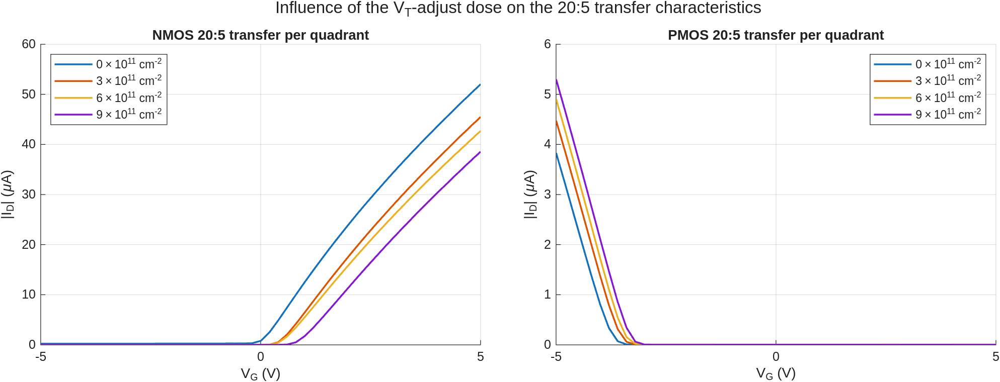
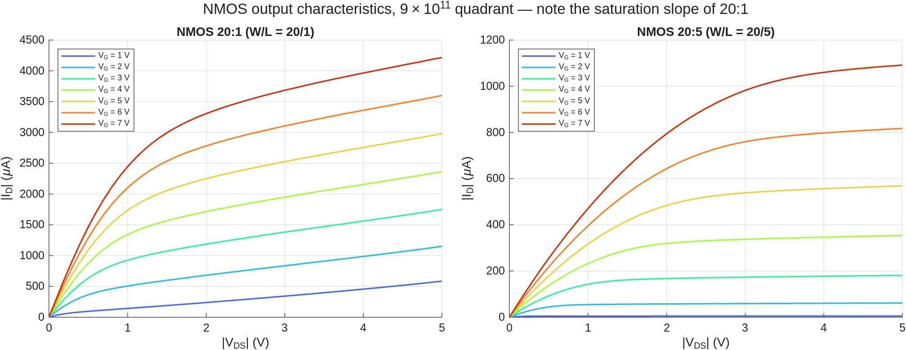
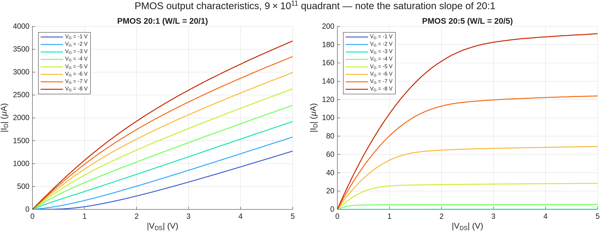
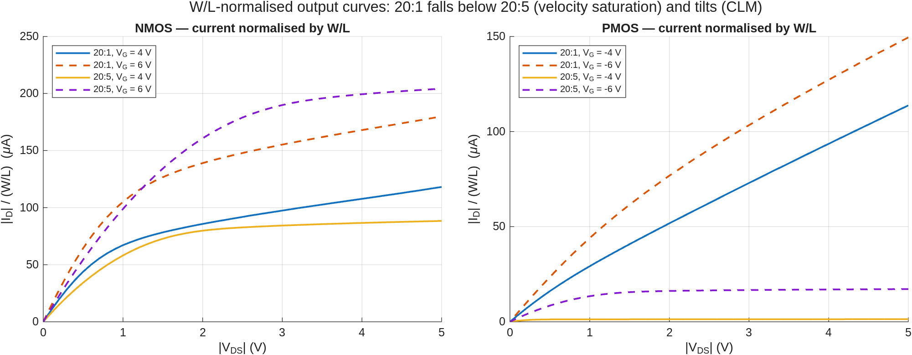

# Chapter 6 — Measurements: assignments & worked results (Group 9)

> Source: *Manual ET4icp 2025v2*, Chapter 6 (pp. 37–44). Every assignment question is quoted and
> answered in place, with the report-ready figures embedded.
> Raw data: [`IC/Group 9/`](IC/Group%209/) · analysis: [`matlab/analyze_ch6.m`](matlab/analyze_ch6.m)
> (`matlab -batch analyze_ch6` regenerates all figures + [`extracted_parameters.txt`](extracted_parameters.txt)).

## Context — why these measurements

In IC fabrication the process is monitored by electrical measurements on test devices (PCM —
process control modules); the same data feeds designers their model parameters. We measure NMOS
and PMOS transistors and two kinds of resistance structures on the BICMOS5 wafer using a
Cascade 31 probe station + Keysight B1500A parameter analyzer (IC-CAP 2022, `ICCourse.mdl`).
Four-point probing is used throughout: two probes force current, two high-impedance probes sense
voltage, so probe/contact resistance drops out.

**Wafer quadrants** (manual fig. 5-2) — each quarter has a different boron V_T-adjust dose:

| Quadrant | top-left | bottom-left | top-right | bottom-right |
|---|---|---|---|---|
| Dose (ions/cm²) | 0 | 3×10¹¹ | 6×10¹¹ | 9×10¹¹ |

**Reference values carried in from earlier chapters** (used throughout):

| Quantity | Value | Source |
|---|---|---|
| x_j NW / SN / SP | 2.085 / 0.537 / 0.594 µm | Ch. 3 Sentaurus (`device_sims/junction_depths.txt`) |
| R□ NW / SN / SP (in-line probe) | 1488.8 / 57.4 / 510.6 Ω/□ | Ch. 4 Q1 |
| N̄ NW / SN / SP (Irvin) | ≈1.5×10¹⁶ / ≈2×10¹⁹ / ≈1.5×10¹⁸ cm⁻³ | Ch. 4 Q3 |
| Simulated V_th NMOS @ 3/6/9×10¹¹ | 0.905 / 1.162 / 1.385 V | Ch. 3 device sims |
| Simulated V_th PMOS @ 3/6/9×10¹¹ | −4.372 / −4.372 / −3.907 V | Ch. 3 device sims |
| C_ox (t_ox = 100 nm) | 3.45×10⁻⁸ F/cm² | ε₀·ε_SiO₂/t_ox |

## Data validation (done before any analysis)

Every Group 9 file was benchmarked against Groups 1, 6, 10, 13, 14, 15 (same wafer, different
dies). VdP comparison (R□, Ω/□):

| Layer | **G9** | G6 | G10 | G13 | G14 | G15 | G1 |
|---|---|---|---|---|---|---|---|
| NW | **1740.5** | 1660.7 | 2109.8 | 1714.3 | ✗ 53166 | 1711.5 | (−)1712.5 |
| SN | **60.2** | 58.0 | 58.7 | 62.0 | ✗ 1366 | 61.5 | (−)61.6 |
| SP | **488.4** | 488.6 | 499.1 | ✗ 68.6 | ✗ 11245 | 482.6 | (−)483.0 |
| IC | **0.160** | 0.160 | 0.143 | 0.151 | 0.156 | ✗ −0.81 | (−)0.157 |

✗ = corrupt measurement in that group's file; (−) = sign flip from swapped sense probes.
Group 9 sits within a few percent of consensus everywhere; ELM and transistor data validate the
same way (all fits R² > 0.99). The data is used as-is for all analyses below.

---

## 1. Van der Pauw measurements

Sheet resistance R□ = ρ/d lets designers compute any resistor as R = R□·L/W (eq. 1). For a
symmetric VdP structure a single 4-point measurement suffices (eq. 2):

```
        π
R□ = ───── · R_AB,CD ≈ 4.532 · R_AB,CD
       ln 2
```

Measurement: VdP IC-CAP model, **top-left quadrant** (V_T-adjust = 0), force-voltage sweep
−0.2 → +0.2 V, substrate grounded.

### Q1.1 — *"Explain why a voltage sweep range from −0.2 V to 0.2 V would ensure the junction remains reverse biased towards the substrate."*

The implanted layers form pn-junctions with the substrate (or well) underneath. A silicon junction
only conducts appreciably above its ~0.6 V exponential knee; within ±0.2 V the junction current is
orders of magnitude below the lateral sheet current **for either polarity** — even the nominally
forward-biased half of the sweep injects negligible substrate current, so the carriers stay
confined in the implanted layer (the VdP requirement). At e.g. ±1 V the forward half would open
the junction and the current would spread through the entire substrate, collapsing the measured
resistance.

### Q1.2 — *"Measure the sheet resistance of all implantations: NW, SN, SP (= SP-NW), also measure the IC layer."*

R_AB,CD = least-squares slope of (V₁ − V₂) vs I_force over the full sweep; then eq. 2:

| Layer | R_AB,CD (Ω) | **R□ (Ω/□)** | fit R² | Ch. 4 in-line probe (Ω/□) |
|---|---|---|---|---|
| NW | 384.02 | **1740.5** | 0.9991 | 1488.8 (+17 %) |
| SN | 13.281 | **60.19** | 0.9991 | 57.4 (+4.9 %) |
| SP (in NW) | 107.75 | **488.4** | 0.9990 | 510.6 (−4.4 %) |
| IC (metal) | 0.0352 | **0.160** | 0.9939 | — |



The NW deviation from Ch. 4 is the largest because the n-well is the most lightly doped layer —
most sensitive to wafer position, surface depletion, and to the different structures probed
(blanket monitor wafer in Ch. 4 vs drawn VdP cloverleaf here).

### Q1.3 — *"Calculate and report the doping concentration of all three implantations using the junction depth from the simulations (chapter 3). Are the calculated doping concentrations the same for the simulations, process measurements (chapter 4) and these final measurements?"*

ρ = R□·x_j, then invert ρ = 1/(q·µ(N)·N) with the Masetti doping-dependent mobility model (the
analytic form of the Irvin curve):

| Layer | x_j (µm) | ρ = R□·x_j (Ω·cm) | µ(N) (cm²/V·s) | **N̄ (cm⁻³)** | Ch. 4 | Ch. 3 sim |
|---|---|---|---|---|---|---|
| NW (P, n) | 2.085 | 0.363 | 1120 | **1.5×10¹⁶** | 1.5×10¹⁶ | 1–2×10¹⁶ background |
| SN (As, n) | 0.537 | 3.23×10⁻³ | 84 | **2.3×10¹⁹** | 2×10¹⁹ | peak 1.8×10²⁰ |
| SP (B, p) | 0.594 | 2.90×10⁻² | 134 | **1.6×10¹⁸** | 1.5×10¹⁸ | peak 1.5×10¹⁸ |

**Answer:** within their meaning, yes.
- Ch. 4 vs Ch. 6 agree to <10 % on all three layers — two independent electrical measurements.
- The VdP value is a **depth-averaged active** concentration: for the steep SN profile it sits
  ~an order below the simulated *peak* (solid-solubility-clipped As); for the flatter NW and SP
  profiles average ≈ peak.
- The measured sheet resistances are only consistent with the *simulated* junction depths — the
  analytic Ch. 2 depths (which ignore the post-implant thermal budget) would give nonsense
  concentrations.

### Q1.4 — *"Compare the sheet resistances between the implantations and the metal, and explain the difference in magnitude."*

R□(metal) = 0.16 Ω/□ vs 60–1740 Ω/□: a difference of 3–4 orders of magnitude. With the 0.2 µm
Al(1 % Si) film thickness, ρ_metal = R□·d = 3.2×10⁻⁶ Ω·cm — exactly the literature value for
Al-1%Si, vs 3×10⁻³–0.36 Ω·cm for the implants. The root cause is carrier density: aluminium has
~1.8×10²³ conduction electrons/cm³ (one+ per atom), the implanted layers only 10¹⁶–10¹⁹ activated
dopants/cm³ — a factor 10⁴–10⁷, partly offset by the higher mobility in lightly doped silicon.
Hence: interconnect from metal, resistors from implanted silicon.

---

## 2. Electrical line-width measurements (ELM)

During annealing, dopant also diffuses **laterally** out of the implantation window, so a line is
electrically wider than drawn: W_eff = W_drawn + 2ΔW. ELM structures (L = 206 µm; W = 2, 5, 10 µm)
have W comparable to ΔW, which makes ΔW measurable.

### Q2.1 — *"Measure the resistance of the NW and SN ELM structures (2, 5, 10 µm); use W/L and eq. 1 to determine the sheet resistance. Compare with the Van der Pauw results — do you notice a difference?"*

| Layer | W (µm) | R (Ω) | R□,app = R·W/L (Ω/□) | vs VdP |
|---|---|---|---|---|
| NW | 2 | 58 833 | 571.2 | −67 % |
| NW | 5 | 38 478 | 933.9 | −46 % |
| NW | 10 | 19 689 | 955.8 | −45 % |
| SN | 2 | 5 244.8 | 50.92 | −15 % |
| SN | 5 | 2 273.5 | 55.18 | −8.3 % |
| SN | 10 | 1 171.1 | 56.85 | −5.5 % |



**Answer:** yes — the apparent R□ (computed with the *drawn* width) is always **lower** than the
VdP value, and the deficit grows as the line narrows. The line conducts more than its drawn
geometry allows because out-diffused dopant widens it; the fixed ΔW matters relatively more for
narrow lines.

### Q2.2 — *"Determine the lateral out-diffusion by plotting sheet resistance as function of width. Compare the amount of out-diffusion between the two implantations — can you explain the difference?"*

Conductance is linear in drawn width: 1/R = (W + 2ΔW)/(R□·L) → slope gives R□, x-intercept −2ΔW:



| Layer | R□ from ELM fit (Ω/□) | **ΔW (µm/side)** | fit R² | VdP R□ (Ω/□) |
|---|---|---|---|---|
| SN | 58.6 | **0.15** | 0.999999 | 60.2 |
| NW | 1129 | **0.80** | 0.986 | 1740.5 |

- **SN** is textbook: perfectly linear conductance, ELM R□ within 2.7 % of VdP, ΔW ≈ 0.15 µm.
- **NW** is not: the three points are non-collinear and the free fit returns R□ well below the VdP
  value. Anchoring the true R□ to the VdP value (1740 Ω/□) instead, the 2 µm and 5 µm lines
  consistently give **ΔW ≈ 2.1 µm/side** — matching the physics (lateral diffusion ≈ 0.8·x_j ≈
  1.7 µm for the 4 h/1150 °C drive-in). The constant-ΔW model is simply too crude for the n-well:
  its lateral "wings" are graded over ~2 µm, so each width samples a different effective sheet
  resistance.

**Why NW ≫ SN out-diffusion?** (1) Thermal budget — the NW phosphorus gets a 4-hour 1150 °C
drive-in (that's what makes it 2 µm deep); diffusion is isotropic so it spreads sideways
comparably. The SN arsenic only sees short anneals. (2) Species — As diffuses ~10× slower than P
at equal temperature. Net: ΔW_NW/ΔW_SN ≈ x_j,NW/x_j,SN ≈ 4–10.

---

## 3. Transistor characterisation

Unified model used for extraction (t_ox = 100 nm):

```
Linear:      I_D = µ·C_ox·(W/L)·[(V_GS − V_th)·V_DS − V_DS²/2]                 (eq. 3)
Saturation:  I_D = (µ·C_ox/2)·(W/L)·(V_GS − V_th)²·[1 + λ(V_DS − V_DSsat)]    (eq. 4)
```

Extraction at |V_DS| = 0.1 V (linear region): V_th by linear extrapolation at maximum
transconductance (V_th = V_G* − I_D*/g_m,max − V_DS/2); mobility from
g_m,max = µ·C_ox·(W/L)·|V_DS|.

### 3.1 PMOS I_D–V_G  (assignment 1) and 3.3 NMOS I_D–V_G (assignment 3)

Sweep V_G −5 → +5 V, V_D = ∓0.1 V, V_sub = 0; **bottom-right quadrant (9×10¹¹)**;
geometries W:L = 20:1, 20:2, 20:5, 20:10, 60:2.


| Type | W:L | W/L | V_th (V) | g_m,max (µS) | µ (cm²/V·s) |
|---|---|---|---|---|---|
| NMOS | 20:1 | 20 | 0.572 | 68.0 | (985)* |
| NMOS | 20:2 | 10 | 0.740 | 27.5 | 796 |
| NMOS | 20:5 | 4 | 0.819 | 10.1 | **734** |
| NMOS | 20:10 | 2 | 0.811 | 5.18 | 750 |
| NMOS | 60:2 | 30 | 0.779 | 80.6 | 778 |
| PMOS | 20:1 | 20 | (−1.733)* | 39.0 | (565)* |
| PMOS | 20:2 | 10 | −3.262 | 10.4 | 301 |
| PMOS | 20:5 | 4 | −3.300 | 3.25 | **236** |
| PMOS | 20:10 | 2 | −3.305 | 1.59 | 230 |
| PMOS | 60:2 | 30 | −3.213 | 31.5 | 304 |

\* L = 1 µm values are short-channel-contaminated (see below).

**Q — "What is the influence of W/L on the obtained characteristics?"**
On-current and transconductance scale ∝ W/L exactly as eq. 3 predicts (g_m,max runs
5.2 → 80.6 µS for W/L = 2 → 30); the curve *shape* — threshold, subthreshold slope — is unchanged
for L ≥ 2 µm.

**Q — "Calculate V_th and the mobility … do these parameters depend on the geometry?"**
They are process parameters and should not — and for L ≥ 2 µm they don't (flat within a few %).
At **L = 1 µm** both extractions break away:



- **V_th roll-off** (NMOS 0.82 → 0.57 V; PMOS −3.30 → −1.73 V): source/drain depletion regions
  support part of the channel depletion charge. The PMOS suffers far more: its junctions are
  deeper (0.59 µm) *and* sit in the lightly doped n-well → wide depletion regions vs L = 1 µm.
- **Apparent µ inflates** (985 vs ≈750): effective channel shortening (ΔL) plus onset of DIBL
  make the L=1 µm device conduct more than its drawn W/L implies.

Representative long-channel values: **µₙ ≈ 730–800, µₚ ≈ 230–300 cm²/V·s**; µₙ/µₚ ≈ 3 — the
silicon electron/hole mobility ratio. Both sit below bulk values (1417/470) as expected for
surface-channel conduction with the V_T-adjust implant at the surface.

**Q — "Measure only the 20:5 transistor for each other quadrant … how does V_th vary over the wafer? Compare with the simulations (ch. 3) and the theory (ch. 2)."**




| V_T-adjust dose (cm⁻²) | NMOS V_th (V) | PMOS V_th (V) |
|---|---|---|
| 0 | −0.034 | −3.702 |
| 3×10¹¹ | 0.388 | −3.511 |
| 6×10¹¹ | 0.432 | −3.413 |
| 9×10¹¹ | 0.819 | −3.300 |

- **NMOS:** V_th rises monotonically with boron dose, ≈0 V (nearly normally-on) → +0.82 V — the
  boron adds acceptor charge that the gate must image. First-order sheet-charge estimate
  q·ΔQ/C_ox = (1.6×10⁻¹⁹ × 9×10¹¹)/3.45×10⁻⁸ ≈ 4.2 V; the measured 0.85 V shift shows only part
  of the dose acts as depletion charge (rest is deeper / compensated), consistent with Ch. 2
  assignment 5.
- **PMOS:** the same boron *compensates* the n-well surface → |V_th| decreases:
  −3.70 → −3.30 V, monotonic across the four quadrants.
- **vs simulation:** Sentaurus reproduces trend and dose sensitivity (NMOS 0.91/1.16/1.39 V,
  PMOS −4.37/−4.37/−3.91 V) but sits ~0.5 V high (NMOS) / ~0.6 V more negative (PMOS) — partly
  the constant-current vs max-g_m extraction difference, partly calibration (interface charge
  Q_ox not in the sim).
- **vs theory (Ch. 2):** qualitatively identical — boron V_T-adjust raises NMOS V_th and makes
  PMOS less negative, NMOS being ~4× more sensitive because the implant lands directly in its
  channel depletion region.

**Q — "Compare all the results to those obtained for the PMOS — same trend and performance? Explain the differences."**
Same trends, opposite signs; very different absolute performance. |V_th| of the PMOS is ~4× the
NMOS value (n-well doping under the gate; 9×10¹¹ boron is nowhere near enough for a symmetric
pair) and PMOS drive current/g_m is ~3× lower at equal geometry (hole mobility). A designer must
size PMOS ≈3× wider; the process would need a larger V_T-adjust dose for symmetric CMOS.

### 3.2 PMOS I_D–V_DS (assignment 2) and 3.4 NMOS I_D–V_DS (assignment 4)

V_DS swept 0 → ∓5 V, V_G stepped (NMOS 1…7 V, PMOS −1…−8 V), V_sub = 0; 9×10¹¹ quadrant;
transistors 20:1 and 20:5.




**Q — "Do you see a difference in the curves of the two transistors (beside the current magnitude)? Explain the cause — two different short-channel effects should be visible."**

Channel-length-modulation parameter λ (slope/intercept of |I_D| vs |V_DS| fitted where
|V_DS| > |V_GS − V_th| + 0.3 V):

| Device | λ (V⁻¹) | behaviour |
|---|---|---|
| NMOS 20:5 | **0.022–0.029** | textbook flat saturation |
| NMOS 20:1 | **0.16–0.42** | strong slope, never truly flat |
| PMOS 20:5 | **0.015–0.018** | flat saturation |
| PMOS 20:1 | not extractable | **never saturates** within −5 V |

1. **Channel-length modulation / drain-field effects:** the pinch-off region Δl is set by the
   drain depletion width, so it eats a fraction Δl/L of the channel — ~2 % for L = 5 µm
   (λ ≈ 0.02 V⁻¹) but ~10× more for L = 1 µm (λ ≈ 0.2 V⁻¹). In the extreme the drain field
   reaches the source (DIBL → punch-through): the PMOS 20:1 behaves almost like a resistor and
   never saturates — its deep (0.59 µm) junctions in the lightly doped n-well make the depletion
   regions as long as the channel.
2. **Velocity saturation:** at L = 1 µm the lateral field reaches ~5×10⁴ V/cm where carrier
   velocity saturates (~10⁷ cm/s). Signatures in the data: the W/L-normalised current of the 20:1
   sits **below** the 20:5 at the same V_G, and successive V_G curves are spaced ~linearly instead
   of quadratically (I_Dsat ∝ (V_GS−V_th) instead of (V_GS−V_th)²).



**Q — "Compare the results with the simulations."**
The Ch. 3 device sims show exactly these signatures: ~7× saturation-current rise where the square
law predicts 8× (velocity-saturation compression) and a finite saturation slope (λ ≠ 0). The
simulated geometry was L = 5 µm-class — no punch-through there, consistent with our clean 20:5
curves.

**Q — "Are there any notable differences between the PMOS and NMOS I_D–V_DS characteristics?"**
- Current scale ~3× lower for PMOS at matched |overdrive| (1.06 mA NMOS 20:5 @ V_G = 7 V vs
  0.124 mA PMOS 20:5 @ V_G = −8 V, at lower overdrive).
- The PMOS short-channel device degrades far more (no saturation at all at L = 1 µm) — deeper SP
  junctions + n-well doping ≈10× below the NMOS-side channel doping.
- Both show the same linear → saturation structure with V_DSat ≈ |V_GS − V_th| for long devices.

---

## 4. Summary — numbers going into the report (Ch. 7)

| Rubric item | Section |
|---|---|
| VdP: sheet resistance + doping correctly determined | §1 |
| ELM: VdP comparison + complete lateral out-diffusion analysis | §2 |
| MOSFET: V_th + mobility calculated & discussed, short-channel effects identified | §3 |
| Conclusions: theory ↔ sim ↔ processing ↔ measurement | §1.3, §3.1, §3.2 |

- R□: NW **1740 Ω/□**, SN **60.2 Ω/□**, SP **488 Ω/□**, metal **0.16 Ω/□**
- N̄: NW **1.5×10¹⁶**, SN **2.3×10¹⁹**, SP **1.6×10¹⁸ cm⁻³** (all within 10 % of Ch. 4)
- Out-diffusion: SN **ΔW ≈ 0.15 µm**, NW **ΔW ≈ 0.8 µm (free fit) / ≈2.1 µm (VdP-anchored)**
- Long-channel: **µₙ ≈ 750, µₚ ≈ 240 cm²/V·s**; V_th(9×10¹¹): NMOS **+0.82 V**, PMOS **−3.30 V**
- V_th(dose 0→9×10¹¹): NMOS **−0.03 → +0.82 V**; PMOS **−3.70 → −3.30 V** (monotonic)
- λ: 20:5 ≈ **0.02 V⁻¹**, 20:1 ≈ **0.2 V⁻¹** (NMOS); PMOS 20:1 punch-through

## Appendix — Group 9 data file map (`IC/Group 9/`)

| File(s) | Measurement |
|---|---|
| `NW_VDP.csv`, `SN_VDP.csv`, `SP_NW_VDP.csv`, `IC_VDP.csv` | VdP sweeps (V_force −0.2→0.2 V; V1, V2 sense; Iforce) |
| `ELM_NW_{2,5,10}um.csv`, `ELM_SN_{2,5,10}um.csv` | ELM 4-pt sweeps (VH, VL sense; Iforce), L = 206 µm |
| `NMOS_20_{1,2,10}_Id_Vg.csv`, `NMOS_60_2_Id_Vg.csv` | NMOS transfer @ BR quadrant (9×10¹¹), V_D = 0.1 V |
| `NMOS_{0e11,3e11,6e11,9e11}_20_5_Id_Vg.csv` | NMOS 20:5 transfer per quadrant |
| `NMOS_9e11_20_{1,5}_Id_Vds.csv` | NMOS output @ 9×10¹¹ |
| `PMOS_…` (same pattern) | PMOS equivalents, V_D = −0.1 V |
